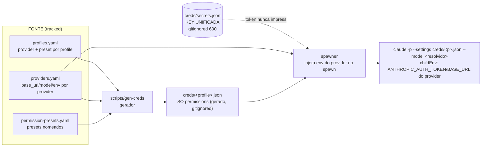

# Provider-Agnostic Creds Generator — Design

**Data:** 2026-07-03
**Status:** Aprovado (design) — pronto para plano de implementação.

## Problema

Hoje cada profile `claude-p` referencia um `settings: creds/<x>.json` que mistura,
no mesmo arquivo, **dois eixos ortogonais**:

- **`env`** (token + `ANTHROPIC_BASE_URL` + `ANTHROPIC_MODEL` + tuning) — *por-provider*.
- **`permissions`** (allow/deny) — *por-papel/profile*.

Consequências medidas (fingerprint SHA-256 dos tokens, sem vazar valor):

| cred | provider | base_url | token sha8 |
|---|---|---|---|
| `deepseek.json` | DeepSeek | `api.deepseek.com/anthropic` | `6316bf69` |
| `deepseek-readonly.json` | DeepSeek | `api.deepseek.com/anthropic` | `6316bf69` |
| `deepseek-memory.json` | DeepSeek | `api.deepseek.com/anthropic` | `6316bf69` |
| `kimi.json` (reservado, sem profile ativo) | Moonshot | `api.moonshot.ai/anthropic` | `38fac483` |

O **mesmo token DeepSeek está duplicado em 3 arquivos**. Adicionar/rotacionar a
key exige editar N arquivos à mão. Não há forma de "selecionar o provider" por
spawn — o provider está congelado dentro de cada cred.

## Objetivo

Tornar o MCP **provider-agnóstico com seleção de provider em spawn-time**, a
partir de uma **key unificada** (fonte única de segredo), gerando os creds
automaticamente a partir do YAML.

## Fatos verificados (doc oficial Claude Code — code.claude.com/docs/en/settings)

1. Claude Code lê `ANTHROPIC_AUTH_TOKEN` / `ANTHROPIC_BASE_URL` / `ANTHROPIC_MODEL`
   do **process env**, e o **process env tem precedência** sobre o bloco `env`
   do settings.json.
2. `settings.json` suporta `permissions.allow/deny`.
3. `settings.json` **NÃO** suporta `mcpServers` — MCP só via `.mcp.json` /
   `--mcp-config`.

**Corolário para o pedido original ("mcp_config e allowed_tools podem sair do
yaml pra creds.json?"):**
- `allowed_tools` → **sim**, vira `permissions.allow` no cred gerado.
- `mcp_config` → **não** (schema não aceita `mcpServers`); permanece no YAML e é
  passado via `--mcp-config`. Hoje só `explorer` usa (semble).

## Arquitetura



### Componentes

**1. `config/creds/secrets.json`** (gitignored, chmod 600) — **fonte única de segredo**.
```json
{ "deepseek": { "ANTHROPIC_AUTH_TOKEN": "sk-..." },
  "moonshot": { "ANTHROPIC_AUTH_TOKEN": "sk-..." } }
```
O token deixa de viver em qualquer cred gerado. Migração do token existente é
**programática** (lê de `creds/deepseek.json`, escreve em `secrets.json`) —
nunca impresso/logado.

**2. `config/providers.yaml`** (tracked, NÃO-secreto) — registry de providers.
```yaml
providers:
  deepseek:
    base_url: https://api.deepseek.com/anthropic
    model: deepseek-v4-pro[1m]          # default quando o provider é escolhido no spawn
    env:                                  # tuning não-secreto (mapeia slots do Claude Code)
      ANTHROPIC_DEFAULT_HAIKU_MODEL: deepseek-v4-pro
      ANTHROPIC_DEFAULT_SONNET_MODEL: deepseek-v4-pro[1m]
      ANTHROPIC_DEFAULT_OPUS_MODEL: deepseek-v4-pro[1m]
      CLAUDE_CODE_SUBAGENT_MODEL: deepseek-v4-pro
      CLAUDE_CODE_EFFORT_LEVEL: high
  moonshot:                              # reservado (espelha kimi.json), sem profile ativo
    base_url: https://api.moonshot.ai/anthropic
    model: kimi-k2.6
    env:
      ENABLE_TOOL_SEARCH: "1"
```
Os valores `env`/`base_url`/`model` acima são NÃO-secretos e devem ser copiados
verbatim dos creds atuais durante a implementação (o token, esse não vai aqui).

**3. `config/permission-presets.yaml`** (tracked) — presets de permissão por papel.
Derivados dos creds atuais, um-para-um:

| preset | fonte atual | usado por |
|---|---|---|
| `no-write` | `deepseek.json` | deepseek, deepseek-1m, coder, analyst, ts/python/csharp/go-reviewer |
| `readonly` | `deepseek-readonly.json` | explorer, reviewer, researcher, security-reviewer, refactorer |
| `write-md` | `deepseek-memory.json` | memory-writer |
| `full` | `deepseek-all.json` (env-only, allow-all) | (nenhum hoje; disponível) |

O bloco `deny` de secrets (`Read(**/.env)`, `Read(**/*.pem)`, `.ssh`, `.aws`,
etc.) aparece em TODOS os presets — copiar verbatim dos creds atuais.

**4. `scripts/gen-creds.ts`** — o gerador.
Para cada profile `claude-p` em `profiles.yaml`:
- resolve `provider = profile.provider ?? "deepseek"` (default) e
  `preset = profile.permissions`;
- escreve `config/creds/<profile>.json` = `{ "$schema": <schema>, "permissions": presets[preset] }`
  (**só permissions — sem env, sem segredo**);
- `chmod 600`.
- **Nunca imprime tokens.** Reporta só nomes de arquivo escritos.
- Profiles `cli` (codex) são ignorados (não têm settings/provider).

**5. `profiles.yaml`** (mudanças por profile `claude-p`):
- **adiciona** `provider: deepseek` (default) e `permissions: <preset>`;
- **remove** `settings:` (derivado por convenção `creds/<name>.json`);
- **remove** `allowed_tools:` (absorvido pelos presets);
- **mantém** `mcp_config:` (não pode ir pro settings.json), `model`,
  `system_prompt`, `bare`, `skills`, `color`, `tags`, `timeout`, `description`.

**6. `spawner.ts`** — injeção de env em runtime.
- `buildClaudePArgs`: mantém `--settings <cred permissions>` e `--model <resolvido>`.
- `spawnAgent`: monta `childEnv = { ...process.env, ANTHROPIC_BASE_URL,
  ANTHROPIC_AUTH_TOKEN (do secrets), ...provider.env }` e passa em `cpSpawn({ env })`.
- **Resolução de model:** se o provider foi sobrescrito no spawn, usa
  `provider.model` (o `profile.model` é provider-específico, ex.
  `deepseek-v4-pro[1m]`); senão usa `profile.model`.

**7. `index.ts` `spawn_agent`** — adiciona input opcional `provider`:
- valida contra o registry de providers (trust boundary — LLM input);
- default = `profile.provider`;
- repassa ao `spawnAgent`.

### Seleção de provider no spawn

`spawn_agent(profile, prompt, provider?)`:
- `provider` omitido → usa `profile.provider` (hoje sempre `deepseek`).
- `provider` informado → valida no registry → injeta o env desse provider e usa
  `provider.model`. Qualquer profile roda em qualquer provider registrado.

## Modelo de segurança (mudança explícita, aprovada)

- **Antes:** token dentro de cada `creds/*.json` (duplicado 3×), arquivos gitignored.
- **Depois:** token só em `config/creds/secrets.json` (gitignored, 600). Os
  `creds/<profile>.json` gerados **não contêm segredo** (só permissions) — mas
  seguem gitignored como artefatos gerados (fonte de verdade é o script + YAMLs).
- Injeção de env: o processo do MCP server lê `secrets.json` e injeta no
  `env` do processo filho. Segredo nunca em arquivo versionado, nunca impresso.
- Presets mantêm o `deny` de leitura de secrets em todos os profiles.

## Escopo e não-escopo

**Escopo:** generator + `secrets.json` + `providers.yaml` +
`permission-presets.yaml`; mudanças em `profiles.yaml` (provider/preset, remove
settings/allowed_tools); `types.ts`, `config.ts`, `spawner.ts`, `index.ts`;
atualização do `creds/README.md` e do header do `profiles.yaml`; testes.

**Refactor preservando comportamento:** cada profile mantém provider (deepseek)
e permissões idênticas às de hoje. Verificação por spawn real (canary por preset),
não por byte-equivalência (o env sai do arquivo).

**Não-escopo (follow-ups documentados):**
- **Bug do `coder`:** system prompt exige Write/Bash/Edit mas preset é `no-write`.
  A migração **preserva** o comportamento atual (`no-write`) — bug **não**
  introduzido aqui. Decisão de dar preset `write` ou reescrever o prompt fica
  para o usuário resolver separadamente.
- Adotar um gateway real (OpenRouter/LiteLLM) fronteando múltiplos providers com
  1 key física: não necessário hoje (só DeepSeek ativo); o registry já suporta
  adicionar providers quando quiser.

## Riscos

- **Precedência process-env vs settings-env:** doc indica process env vence;
  validar por spawn real que o token injetado roteia pro provider certo.
- **`--model` flag vs `ANTHROPIC_MODEL` env:** para evitar conflito, o gerador
  **não** coloca `ANTHROPIC_MODEL` no env do provider; model vem só do flag
  `--model`. (Os `ANTHROPIC_DEFAULT_*_MODEL` de tuning permanecem no provider.env.)
- **Bootstrap do `secrets.json`:** deve ler o token dos creds atuais
  programaticamente e nunca ecoá-lo.
```
