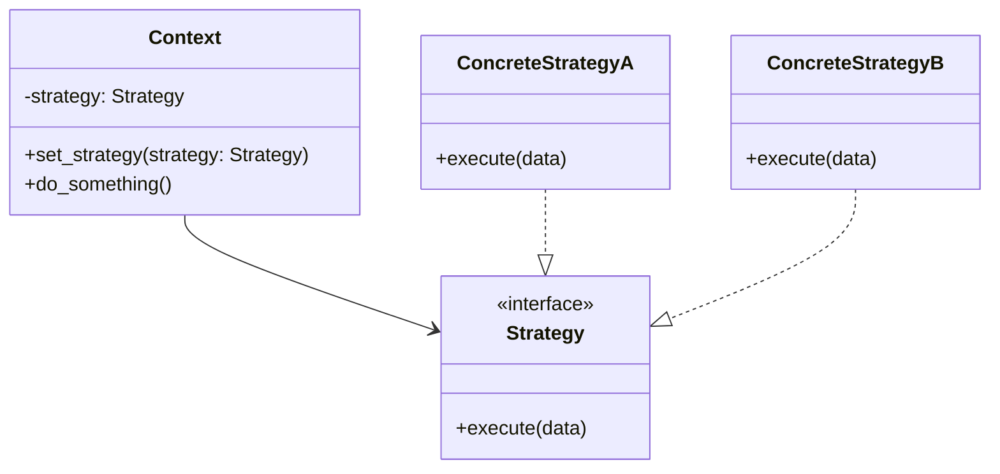

# Design Patterns em Python — Skill de Referência

Skill que fornece acesso rápido aos 22 Design Patterns do GoF com exemplos em Python moderno,
extraídos do Refactoring.Guru e enriquecidos com diagramas e orientação prática.

## Quando esta skill é acionada

- Usuário pergunta sobre um design pattern específico (ex: "me mostra o Strategy em Python")
- Usuário quer ajuda para escolher um pattern (ex: "qual pattern usar para desacoplar...")
- Usuário quer refatorar código usando um pattern
- Usuário pede comparação entre patterns
- Usuário menciona qualquer nome de GoF pattern no contexto Python

## Como usar os arquivos de referência

Os exemplos de código e descrições ficam em arquivos separados por categoria.
**Leia APENAS o arquivo do pattern relevante**, não carregue tudo de uma vez.

### Estrutura dos arquivos

```
patterns/
├── creational/          # Padrões Criacionais
│   ├── abstract-factory.md
│   ├── builder.md
│   ├── factory-method.md
│   ├── prototype.md
│   └── singleton.md
├── structural/          # Padrões Estruturais
│   ├── adapter.md
│   ├── bridge.md
│   ├── composite.md
│   ├── decorator.md
│   ├── facade.md
│   ├── flyweight.md
│   └── proxy.md
└── behavioral/          # Padrões Comportamentais
    ├── chain-of-responsibility.md
    ├── command.md
    ├── iterator.md
    ├── mediator.md
    ├── memento.md
    ├── observer.md
    ├── state.md
    ├── strategy.md
    ├── template-method.md
    └── visitor.md
```

### Índice rápido por pattern

| Pattern | Categoria | Arquivo | Propósito resumido |
|---------|-----------|---------|-------------------|
| Abstract Factory | Criacional | `creational/abstract-factory.md` | Produzir famílias de objetos relacionados |
| Builder | Criacional | `creational/builder.md` | Construir objetos complexos passo a passo |
| Factory Method | Criacional | `creational/factory-method.md` | Delegar criação a subclasses |
| Prototype | Criacional | `creational/prototype.md` | Clonar objetos existentes |
| Singleton | Criacional | `creational/singleton.md` | Garantir instância única |
| Adapter | Estrutural | `structural/adapter.md` | Compatibilizar interfaces incompatíveis |
| Bridge | Estrutural | `structural/bridge.md` | Separar abstração de implementação |
| Composite | Estrutural | `structural/composite.md` | Compor objetos em estruturas de árvore |
| Decorator | Estrutural | `structural/decorator.md` | Adicionar comportamentos via wrapper |
| Facade | Estrutural | `structural/facade.md` | Interface simplificada para subsistema complexo |
| Flyweight | Estrutural | `structural/flyweight.md` | Compartilhar estado para economizar memória |
| Proxy | Estrutural | `structural/proxy.md` | Substituto que controla acesso |
| Chain of Resp. | Comportamental | `behavioral/chain-of-responsibility.md` | Passar pedidos por uma cadeia de handlers |
| Command | Comportamental | `behavioral/command.md` | Encapsular pedido como objeto |
| Iterator | Comportamental | `behavioral/iterator.md` | Percorrer elementos sem expor estrutura |
| Mediator | Comportamental | `behavioral/mediator.md` | Reduzir dependências entre objetos |
| Memento | Comportamental | `behavioral/memento.md` | Salvar e restaurar estado anterior |
| Observer | Comportamental | `behavioral/observer.md` | Notificar sobre mudanças de estado |
| State | Comportamental | `behavioral/state.md` | Alterar comportamento conforme estado interno |
| Strategy | Comportamental | `behavioral/strategy.md` | Intercambiar algoritmos em runtime |
| Template Method | Comportamental | `behavioral/template-method.md` | Esqueleto de algoritmo com passos customizáveis |
| Visitor | Comportamental | `behavioral/visitor.md` | Separar algoritmos dos objetos que operam |

## Idiomas Python que você DEVE respeitar

Python é dinâmico, usa duck typing e tem funções de primeira classe. Isso muda como vários patterns GoF se materializam. Antes de recomendar um pattern, verifique se a versão Python faz sentido:

- **Sem herança obrigatória → composição e Protocolos.** Muitos patterns que em Java/C# usam interfaces explícitas podem ser expressos com `Protocol` (PEP 544) ou simplesmente duck typing.
- **Funções de primeira classe.** Strategy, Command e Template Method frequentemente ficam mais simples como funções ou closures do que como hierarquias de classes.
- **Módulos são singletons naturais.** Em Python, um módulo é carregado uma única vez. Prefira isso a implementações manuais de Singleton quando possível.
- **Decorators Python (`@`) vs Decorator pattern.** O decorator sintático do Python é uma forma comum de aplicar o Decorator pattern, mas nem sempre é a melhor escolha. Use composição quando precisar manter a interface original.
- **Exceptions como controle de fluxo.** Patterns que em outras linguagens usam retornos especiais (Chain of Responsibility, Command) em Python podem usar exceções ou `Optional[T]`.
- **`abc.ABC` + `@abstractmethod` quando necessário.** Use quando quiser forçar uma interface explícita, mas não como padrão para todo pattern.
- **`dataclasses` para objetos simples.** Use `@dataclass` para reduzir boilerplate em DTOs, Mementos e Value Objects.

## Fluxo de resposta

Siga este fluxo ao responder sobre design patterns:

### 1. Identificar o pattern

Se o usuário menciona um pattern por nome, use o arquivo correspondente:
```
patterns/{categoria}/{pattern-slug}.md
```

Se o usuário descreve um problema sem mencionar um pattern, use o índice acima para
recomendar o(s) pattern(s) mais adequados. Explique brevemente por que cada um se aplica.

### 2. Apresentar a resposta

A resposta deve incluir, nesta ordem:

1. **Propósito** — Uma frase explicando o que o pattern resolve
2. **Diagrama** — Gerar um diagrama Mermaid com as classes/interfaces envolvidas
3. **Quando usar** — Situações práticas onde o pattern se aplica
4. **Exemplo em Python** — Código do arquivo de referência, adaptado se o usuário deu contexto
5. **Variante pythonica** — Se aplicável, mostrar versões idiomáticas (funções, Protocol, dataclass, etc.)
6. **Cuidados** — Armadilhas comuns ou trade-offs
7. **Patterns relacionados** — Outros patterns que complementam ou são alternativas

### 3. Contextualizar quando possível

Se o usuário forneceu contexto sobre seu projeto (ex: FastAPI, Django, Flask, scripts, etc.),
adapte o exemplo de código para usar nomes e estruturas relevantes ao contexto dele.
Não dê exemplos genéricos se tiver informação para personalizar.

### 4. Diagramas Mermaid

Sempre gere um diagrama de classes Mermaid para o pattern. Exemplo de formato:



## Guia de decisão: qual pattern usar?

Quando o usuário não sabe qual pattern precisa, use estas perguntas:

| Problema | Pattern(s) sugerido(s) |
|----------|----------------------|
| Preciso criar objetos sem especificar a classe concreta | Factory Method, Abstract Factory |
| Preciso construir um objeto complexo com muitas configurações | Builder |
| Preciso copiar objetos sem depender de suas classes | Prototype |
| Preciso garantir uma única instância global | Singleton (mas considere módulo Python primeiro) |
| Preciso adaptar uma interface incompatível | Adapter |
| Tenho muitas classes com combinações de variantes | Bridge |
| Preciso trabalhar com estruturas de árvore | Composite |
| Preciso adicionar responsabilidades dinamicamente | Decorator |
| Preciso simplificar uma API complexa | Facade |
| Tenho milhares de objetos similares consumindo memória | Flyweight |
| Preciso controlar acesso, cache, ou lazy loading | Proxy |
| Preciso processar um pedido por múltiplos handlers | Chain of Responsibility |
| Preciso desacoplar quem invoca de quem executa | Command |
| Preciso percorrer uma coleção sem expor sua estrutura | Iterator (ou generators) |
| Tenho muitos objetos se comunicando de forma caótica | Mediator |
| Preciso de undo/redo ou snapshots de estado | Memento |
| Preciso notificar vários objetos sobre mudanças | Observer |
| O comportamento muda conforme o estado do objeto | State |
| Preciso trocar algoritmos em runtime | Strategy |
| Tenho um algoritmo com passos fixos mas customizáveis | Template Method |
| Preciso adicionar operações sem modificar as classes | Visitor |

## Patterns mais usados no ecossistema Python

| Framework/Contexto | Patterns comuns |
|-------------------|----------------|
| **FastAPI / Flask** | Dependency Injection, Singleton (app/config), Strategy, Observer |
| **Django** | Singleton (settings), Factory (ModelForm, ModelAdmin), Decorator (middleware), Command |
| **CLI / Click / Typer** | Command, Chain of Responsibility |
| **Data pipelines** | Chain of Responsibility, Strategy, Template Method |
| **Testing** | Builder (test data), Strategy (mocks), Adapter (test doubles), Factory |

## Referência externa

Todos os patterns são baseados no catálogo do Refactoring.Guru:
https://refactoring.guru/pt-br/design-patterns/python

Para aprofundamento, o livro original é:
"Design Patterns: Elements of Reusable Object-Oriented Software" — Gang of Four (GoF)
