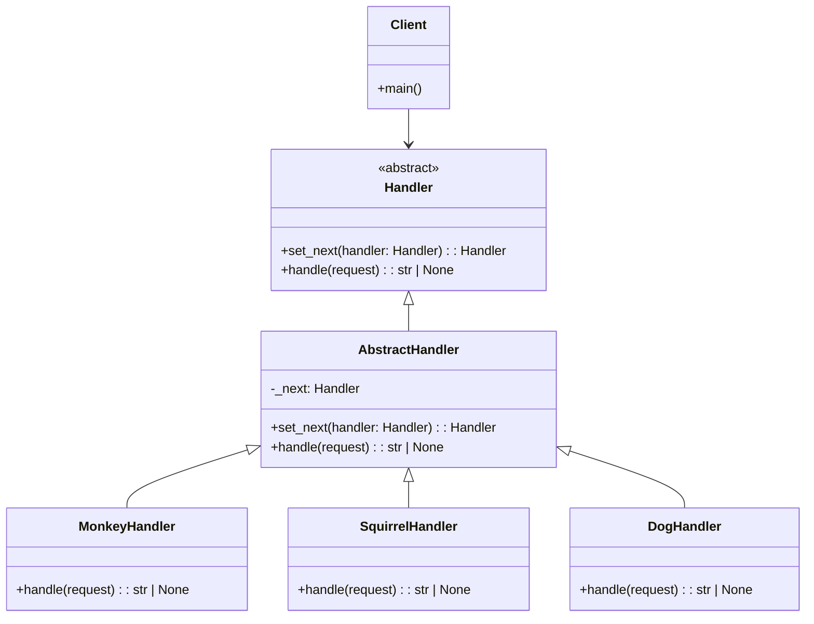

# Chain of Responsibility

**Categoria:** Padrões Comportamentais  
**Referência:** https://refactoring.guru/pt-br/design-patterns/chain-of-responsibility

## Propósito

O Chain of Responsibility é um padrão de projeto comportamental que permite que você passe pedidos por uma corrente de handlers. Ao receber um pedido, cada handler decide se processa o pedido ou o passa adiante para o próximo handler na corrente.

## Problema

Imagine que você está trabalhando em um sistema de encomendas online. Você quer restringir o acesso ao sistema para que apenas usuários autenticados possam criar pedidos. E também somente usuários que têm permissões administrativas devem ter acesso total a todos os pedidos.

Após um pouco de planejamento, você se dá conta de que essas checagens devem ser feitas sequencialmente. A aplicação pode tentar autenticar um usuário ao sistema sempre que receber um pedido que contém as credenciais do usuário. Se a autenticação falhar, a aplicação pode tentar outras formas de verificação, e assim por diante, até que o pedido seja aceito, rejeitado ou chegue ao fim da corrente.

## Como Implementar

1. Declare a interface do handler e descreva a assinatura de um método para lidar com pedidos.
2. Decida como o cliente irá passar os dados do pedido para o método. A maneira mais flexível é converter o pedido em um objeto e passá-lo para o método handler como um argumento.
3. Para eliminar código padrão duplicado nos handlers concretos, crie uma classe handler base abstrata derivada da interface do handler.
4. Essa classe deve ter um campo para armazenar uma referência ao próximo handler na corrente. Considere tornar a classe imutável. Contudo, se você planeja modificar correntes em tempo de execução, defina um setter para alterar o valor do campo de referência.
5. Você também pode implementar o comportamento padrão conveniente para o método handler, que vai passar o pedido adiante se não houver interesse em processá-lo.
6. Crie handlers concretos subclasses da classe base. Cada handler deve decidir se processa o pedido ou o repassa ao próximo.
7. O cliente pode montar a corrente conforme a necessidade e enviar pedidos para qualquer handler, não apenas o primeiro.

## Relações com Outros Padrões

O Chain of Responsibility, Command, Mediator e Observer abrangem várias maneiras de se conectar remetentes e destinatários de pedidos:

- O **Chain of Responsibility** passa um pedido sequencialmente ao longo de uma corrente dinâmica de potenciais destinatários até que um deles atue no pedido.
- O **Command** estabelece conexões unidirecionais entre remetentes e destinatários.
- O **Mediator** elimina as conexões diretas entre remetentes e destinatários, forçando-os a se comunicar indiretamente através de um objeto mediador.
- O **Observer** permite que destinatários se inscrevam e cancelem a inscrição dinamicamente para receber pedidos.

## Diagrama



## Exemplo em Python

```python
from __future__ import annotations

from abc import ABC


class AbstractHandler(ABC):
    """Handler base que implementa o encadeamento padrão.

    As subclasses herdaram o comportamento de repassar o pedido para
    o próximo handler quando não conseguem processá-lo.
    """

    def __init__(self) -> None:
        self._next: AbstractHandler | None = None

    def set_next(self, handler: AbstractHandler) -> AbstractHandler:
        """Define o próximo handler na corrente."""
        self._next = handler
        # Retornar o handler permite encadear chamadas:
        # monkey.set_next(squirrel).set_next(dog)
        return handler

    def handle(self, request: str) -> str | None:
        """Repassa o pedido adiante, a menos que uma subclasse o processe."""
        if self._next is not None:
            return self._next.handle(request)
        return None


class MonkeyHandler(AbstractHandler):
    """Processa pedidos do tipo 'Banana'."""

    def handle(self, request: str) -> str | None:
        if request == "Banana":
            return f"Monkey: I'll eat the {request}."
        return super().handle(request)


class SquirrelHandler(AbstractHandler):
    """Processa pedidos do tipo 'Nut'."""

    def handle(self, request: str) -> str | None:
        if request == "Nut":
            return f"Squirrel: I'll eat the {request}."
        return super().handle(request)


class DogHandler(AbstractHandler):
    """Processa pedidos do tipo 'MeatBall'."""

    def handle(self, request: str) -> str | None:
        if request == "MeatBall":
            return f"Dog: I'll eat the {request}."
        return super().handle(request)


def client_code(handler: AbstractHandler) -> None:
    """Código cliente que envia pedidos para um handler da corrente."""
    foods = ["Nut", "Banana", "Cup of coffee"]

    for food in foods:
        print(f"Client: Who wants a {food}?")

        result = handler.handle(food)
        if result:
            print(f"   {result}")
        else:
            print(f"   {food} was left untouched.")


if __name__ == "__main__":
    monkey = MonkeyHandler()
    squirrel = SquirrelHandler()
    dog = DogHandler()

    # Monta a corrente: Monkey -> Squirrel -> Dog
    monkey.set_next(squirrel).set_next(dog)

    print("Chain: Monkey > Squirrel > Dog\n")
    client_code(monkey)
    print()

    print("Subchain: Squirrel > Dog\n")
    client_code(squirrel)
```

## Output

```text
Chain: Monkey > Squirrel > Dog

Client: Who wants a Nut?
   Squirrel: I'll eat the Nut.
Client: Who wants a Banana?
   Monkey: I'll eat the Banana.
Client: Who wants a Cup of coffee?
   Cup of coffee was left untouched.

Subchain: Squirrel > Dog

Client: Who wants a Nut?
   Squirrel: I'll eat the Nut.
Client: Who wants a Banana?
   Banana was left untouched.
Client: Who wants a Cup of coffee?
   Cup of coffee was left untouched.
```
