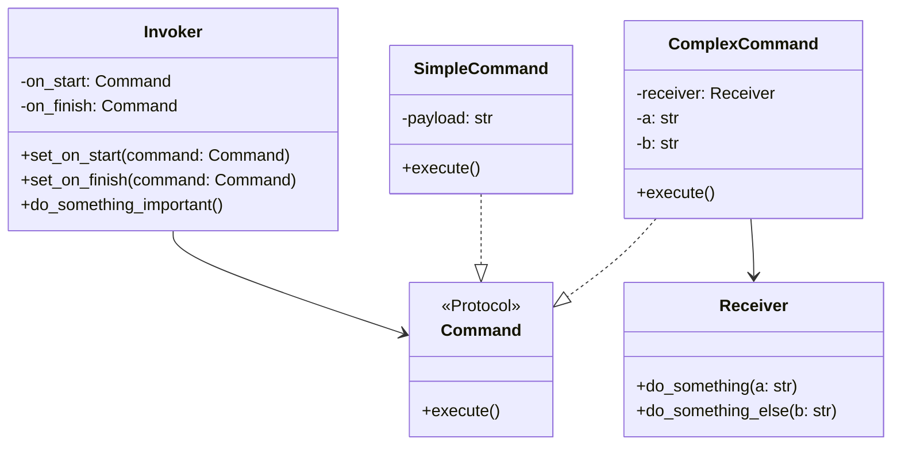

# Command

**Categoria:** Padrões Comportamentais
**Referência:** https://refactoring.guru/pt-br/design-patterns/command
**Exemplo Python:** https://refactoring.guru/pt-br/design-patterns/command/python/example

## Propósito

O Command é um padrão de projeto comportamental que transforma um pedido em um objeto independente que contém toda a informação sobre o pedido, permitindo parametrizar métodos, enfileirar execuções, implementar undo/redo e desacoplar quem invoca de quem executa.

## Problema

Imagine que você está criando uma aplicação de editor de texto com uma barra de ferramentas. Cada botão precisa executar uma ação diferente: copiar, colar, desfazer, enviar por e-mail etc.

Se o código de cada ação ficasse acoplado diretamente à classe do botão, adicionar novos botões ou reutilizar a mesma ação em outro lugar (por exemplo, em um atalho de teclado) exigiria duplicar código. Ainda pior: o botão passaria a depender de classes concretas do editor, dificultando testes e manutenção.

A solução é encapsular cada ação como um objeto independente. O botão passa a disparar um comando, sem saber qual operação será realizada nem quem a realizará.

## Como Implementar

1. **Declare o contrato do comando.** Em Python, um `Protocol` com um método `execute` costuma ser suficiente.
2. **Crie classes concretas de comando** para cada pedido. Elas armazenam os argumentos necessários e, quando aplicável, uma referência ao objeto destinatário (*receiver*) que contém a lógica de negócio.
3. **Identifique os remetentes (*invokers*).** Essas classes devem possuir campos para armazenar comandos e interagir com eles apenas através do contrato do comando.
4. **Substitua chamadas diretas por execuções de comando.** O remetente não conhece o destinatário final; ele apenas invoca `execute()`.
5. **No código cliente, monte os comandos e associe-os aos remetentes.** É comum também armazenar comandos em pilhas ou filas para suportar undo/redo ou execução assíncrona.

## Relações com Outros Padrões

O **Chain of Responsibility**, **Command**, **Mediator** e **Observer** abordam diferentes formas de conectar remetentes e destinatários de pedidos:

- O **Chain of Responsibility** passa um pedido sequencialmente ao longo de uma corrente dinâmica de potenciais destinatários até que um deles atue no pedido.
- O **Command** estabelece conexões unidirecionais entre remetentes e destinatários.
- O **Mediator** elimina as conexões diretas entre remetentes e destinatários, forçando-os a se comunicar indiretamente através de um objeto mediador.
- O **Observer** permite que destinatários se inscrevam e cancelem a inscrição dinamicamente para receber notificações de um remetente.

Outras relações importantes:

- **Command e Strategy** podem parecer similares porque ambos parametrizam objetos com ações. A diferença é que o Command encapsula um pedido como um objeto autônomo (com undo/redo, fila etc.), enquanto o Strategy muda o núcleo de como o contexto realiza seu trabalho.
- **Command e Memento** costumam andar juntos quando é necessário implementar undo/redo: o Command executa a operação e o Memento guarda o estado anterior.
- **Command e Composite** podem ser combinados para criar comandos compostos (*macros*) que executam vários comandos de uma só vez.
- **Prototype** pode ser útil para clonar comandos antes de colocá-los em uma fila ou histórico.

## Diagrama Mermaid



## Exemplo em Python

```python
from __future__ import annotations

from dataclasses import dataclass
from typing import Protocol


class Command(Protocol):
    """Contrato comum a todos os comandos."""

    def execute(self) -> None:
        """Executa o pedido encapsulado."""
        ...


@dataclass
class SimpleCommand:
    """Comando simples que executa uma operação por conta própria."""

    payload: str

    def execute(self) -> None:
        print(f"SimpleCommand: Veja, consigo fazer coisas simples como imprimir ({self.payload})")


@dataclass
class ComplexCommand:
    """Comando complexo que delega a execução a um receiver."""

    receiver: Receiver
    a: str
    b: str

    def execute(self) -> None:
        print("ComplexCommand: Coisas complexas devem ser feitas por um objeto receiver.")
        self.receiver.do_something(self.a)
        self.receiver.do_something_else(self.b)


class Receiver:
    """Contém a lógica de negócio real associada à execução de um pedido."""

    def do_something(self, a: str) -> None:
        print(f"Receiver: Trabalhando em ({a}.)")

    def do_something_else(self, b: str) -> None:
        print(f"Receiver: Também trabalhando em ({b}.)")


class Invoker:
    """Dispara comandos sem depender de classes concretas."""

    def __init__(self) -> None:
        self._on_start: Command | None = None
        self._on_finish: Command | None = None

    def set_on_start(self, command: Command | None) -> None:
        """Define o comando executado no início da operação."""
        self._on_start = command

    def set_on_finish(self, command: Command | None) -> None:
        """Define o comando executado ao final da operação."""
        self._on_finish = command

    def do_something_important(self) -> None:
        """Lógica principal do invoker, parametrizada por comandos."""
        print("Invoker: Alguém quer que eu faça algo antes de começar?")
        if self._on_start is not None:
            self._on_start.execute()

        print("Invoker: ...fazendo algo realmente importante...")

        print("Invoker: Alguém quer que eu faça algo depois de terminar?")
        if self._on_finish is not None:
            self._on_finish.execute()


if __name__ == "__main__":
    # O cliente parametriza o invoker com comandos concretos.
    invoker = Invoker()
    invoker.set_on_start(SimpleCommand("Diga oi!"))

    receiver = Receiver()
    invoker.set_on_finish(ComplexCommand(receiver, "Enviar e-mail", "Salvar relatório"))

    invoker.do_something_important()
```

### Output

```
Invoker: Alguém quer que eu faça algo antes de começar?
SimpleCommand: Veja, consigo fazer coisas simples como imprimir (Diga oi!)
Invoker: ...fazendo algo realmente importante...
Invoker: Alguém quer que eu faça algo depois de terminar?
ComplexCommand: Coisas complexas devem ser feitas por um objeto receiver.
Receiver: Trabalhando em (Enviar e-mail.)
Receiver: Também trabalhando em (Salvar relatório.)
```

## Variante Pythonica

Em Python, comandos simples frequentemente não precisam de uma classe dedicada. Uma função de primeira classe já pode ser usada como comando, reduzindo drasticamente o *boilerplate* quando não há necessidade de undo/redo ou histórico:

```python
from typing import Callable


def invoker(do_before: Callable[[], None] | None = None,
            do_after: Callable[[], None] | None = None) -> None:
    print("Antes...")
    if do_before:
        do_before()
    print("Fazendo algo importante...")
    print("Depois...")
    if do_after:
        do_after()


if __name__ == "__main__":
    invoker(
        do_before=lambda: print("Diga oi!"),
        do_after=lambda: print("Enviar e-mail"),
    )
```
