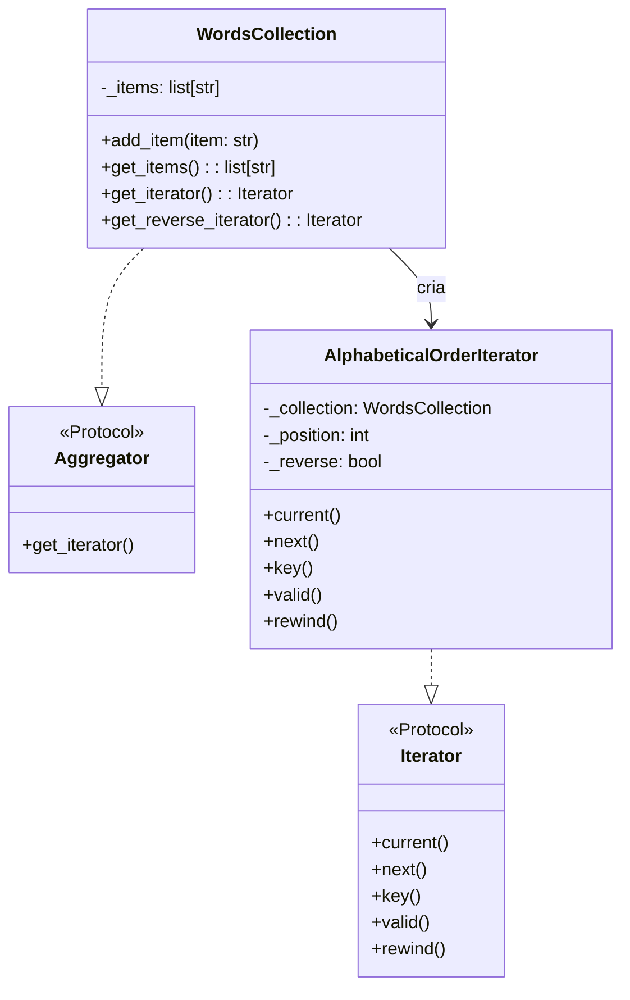

# Iterator

**Categoria:** Padrões Comportamentais
**Referência:** https://refactoring.guru/pt-br/design-patterns/iterator
**Exemplo Python:** https://refactoring.guru/pt-br/design-patterns/iterator/python/example

## Propósito

O Iterator é um padrão de projeto comportamental que permite percorrer elementos de uma coleção sem expor sua representação interna (lista, pilha, árvore, etc.).

## Problema

Coleções são estruturas de dados fundamentais, mas nem sempre armazenam seus elementos de forma simples: pilhas, filas, árvores e grafos exigem formas distintas de travessia. Se o código cliente precisar conhecer essa estrutura interna para iterar, o acoplamento aumenta e a manutenção fica difícil quando a representação muda.

O Iterator resolve isso extraindo a lógica de travessia para um objeto separado, oferecendo uma interface uniforme (`next`, `current`, `valid`, etc.) independentemente de como a coleção está organizada.

## Como Implementar

1. Declare uma interface/protocolo para o iterador com os métodos essenciais de travessia (por exemplo: `current`, `next`, `valid`, `rewind`).
2. Declare uma interface/protocolo para a coleção descrevendo como obter um novo iterador.
3. Implemente iteradores concretos para cada algoritmo de travessia desejado. Cada iterador deve manter seu próprio estado de iteração (posição, direção, etc.).
4. Implemente a coleção concreta e faça com que ela retorne instâncias do iterador adequado.
5. O cliente itera usando apenas a interface do iterador, sem acessar a coleção diretamente.

## Relações com Outros Padrões

- Você pode usar **Iterator** para percorrer árvores **Composite**.
- Você pode usar **Factory Method** junto com **Iterator** para permitir que subclasses de coleções retornem tipos diferentes de iteradores compatíveis.
- Você pode usar **Memento** junto com **Iterator** para capturar e restaurar o estado da iteração.
- Você pode usar **Visitor** junto com **Iterator** para percorrer uma estrutura complexa e executar operações sobre seus elementos.

## Diagrama



## Exemplo em Python

```python
from __future__ import annotations

from typing import Protocol


class Iterator(Protocol):
    """Protocolo que define a interface de um iterador explícito."""

    def current(self) -> str: ...
    def next(self) -> str: ...
    def key(self) -> int: ...
    def valid(self) -> bool: ...
    def rewind(self) -> None: ...


class Aggregator(Protocol):
    """Protocolo que define a interface de uma coleção iterável."""

    def get_iterator(self) -> Iterator: ...


class AlphabeticalOrderIterator:
    """Iterador concreto que percorre uma WordsCollection em ordem alfabética."""

    def __init__(self, collection: WordsCollection, reverse: bool = False) -> None:
        self._collection = collection
        self._reverse = reverse
        self._position = len(self._collection.get_items()) - 1 if reverse else 0

    def current(self) -> str:
        return self._collection.get_items()[self._position]

    def next(self) -> str:
        item = self.current()
        self._position += -1 if self._reverse else 1
        return item

    def key(self) -> int:
        return self._position

    def valid(self) -> bool:
        return 0 <= self._position < len(self._collection.get_items())

    def rewind(self) -> None:
        self._position = len(self._collection.get_items()) - 1 if self._reverse else 0


class WordsCollection:
    """Coleção concreta que expõe iteradores de travessia direta e reversa."""

    def __init__(self) -> None:
        self._items: list[str] = []

    def get_items(self) -> list[str]:
        return self._items

    def add_item(self, item: str) -> None:
        self._items.append(item)

    def get_iterator(self) -> Iterator:
        return AlphabeticalOrderIterator(self)

    def get_reverse_iterator(self) -> Iterator:
        return AlphabeticalOrderIterator(self, reverse=True)


if __name__ == "__main__":
    collection = WordsCollection()
    collection.add_item("First")
    collection.add_item("Second")
    collection.add_item("Third")

    print("Straight traversal:")
    iterator = collection.get_iterator()
    while iterator.valid():
        print(iterator.next())

    print("\nReverse traversal:")
    reverse_iterator = collection.get_reverse_iterator()
    while reverse_iterator.valid():
        print(reverse_iterator.next())
```

### Output

```
Straight traversal:
First
Second
Third

Reverse traversal:
Third
Second
First
```

