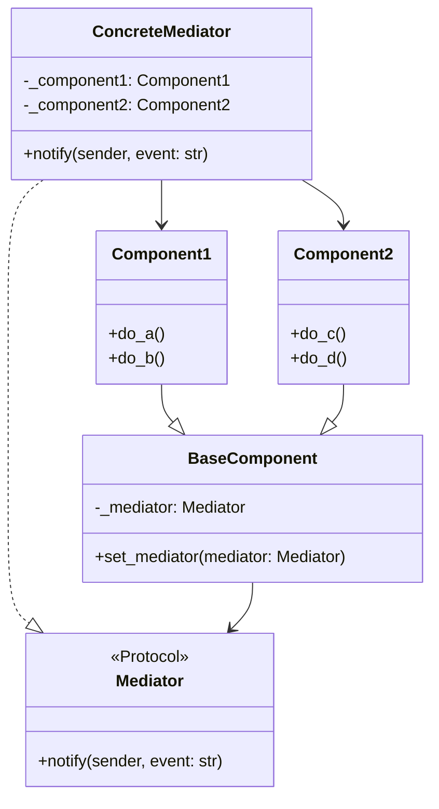

# Mediator

**Categoria:** Padrões Comportamentais
**Referência:** https://refactoring.guru/pt-br/design-patterns/mediator

## Propósito

O Mediator é um padrão de projeto comportamental que permite que você reduza as dependências caóticas entre objetos. O padrão restringe comunicações diretas entre objetos e os força a colaborar apenas através do objeto mediador.

## Problema

Imagine uma caixa de diálogo para criar e editar perfis de clientes, composta por campos de texto, caixas de seleção, botões e outros controles. Alguns elementos precisam reagir a mudanças em outros: marcar "Eu tenho um cão" pode revelar um campo para o nome do cachorro; o botão de enviar precisa validar todos os campos antes de salvar.

Se cada componente conhecer e se comunicar diretamente com os demais, a manutenção se torna um pesadelo: adicionar um novo controle exige alterar várias classes, e reutilizar um componente em outra tela fica praticamente impossível.

## Como Implementar

1. Identifique um grupo de classes fortemente acopladas que se beneficiariam de ficar mais independentes.
2. Declare um contrato comum para o mediador. Em Python, `Protocol` costuma ser mais idiomático do que uma classe abstrata obrigatória.
3. Implemente o mediador concreto. Ele deve conhecer os componentes que coordena e centralizar as regras de interação entre eles.
4. Crie uma classe base para os componentes, responsável por manter uma referência ao mediador.
5. Implemente os componentes concretos. Eles não devem depender uns dos outros, apenas notificar o mediador sobre eventos relevantes.
6. O cliente instancia os componentes e o mediador, que se conectam automaticamente.

## Relações com Outros Padrões

- **Chain of Responsibility, Command, Mediator e Observer** abordam diferentes formas de conectar remetentes e destinatários de pedidos.
- O **Chain of Responsibility** passa um pedido ao longo de uma corrente dinâmica de potenciais destinatários até que um deles atue.
- O **Command** estabelece conexões unidirecionais entre remetentes e destinatários, encapsulando o pedido como um objeto.
- O **Mediator** elimina as conexões diretas entre remetentes e destinatários, forçando-os a se comunicar indiretamente através de um objeto central.
- O **Observer** estabelece um mecanismo de publicação/assinatura direto entre remetentes e destinatários.
- O **Facade** e o **Mediator** têm tarefas parecidas: ambos organizam a colaboração entre classes firmemente acopladas. O Facade define uma interface simplificada para um subsistema, mas não introduz nenhuma funcionalidade nova; as classes do subsistema continuam se comunicando diretamente. Já o Mediator centraliza a comunicação entre componentes, que só podem colaborar através dele.

## Diagrama



## Exemplo em Python

```python
from typing import Protocol


class Mediator(Protocol):
    """Contrato comum para mediadores."""

    def notify(self, sender: object, event: str) -> None:
        ...


class BaseComponent:
    """Funcionalidade básica compartilhada pelos componentes."""

    def __init__(self, mediator: Mediator | None = None) -> None:
        self._mediator = mediator

    def set_mediator(self, mediator: Mediator) -> None:
        """Atualiza o mediador associado a este componente."""
        self._mediator = mediator


class Component1(BaseComponent):
    """Componente concreto que emite eventos A e B."""

    def do_a(self) -> None:
        print("Component 1 does A.")
        if self._mediator is not None:
            self._mediator.notify(self, "A")

    def do_b(self) -> None:
        print("Component 1 does B.")
        if self._mediator is not None:
            self._mediator.notify(self, "B")


class Component2(BaseComponent):
    """Componente concreto que emite eventos C e D."""

    def do_c(self) -> None:
        print("Component 2 does C.")
        if self._mediator is not None:
            self._mediator.notify(self, "C")

    def do_d(self) -> None:
        print("Component 2 does D.")
        if self._mediator is not None:
            self._mediator.notify(self, "D")


class ConcreteMediator:
    """Mediador concreto que coordena Component1 e Component2."""

    def __init__(self, component1: Component1, component2: Component2) -> None:
        self._component1 = component1
        self._component1.set_mediator(self)

        self._component2 = component2
        self._component2.set_mediator(self)

    def notify(self, sender: object, event: str) -> None:
        if event == "A":
            print("Mediator reacts on A and triggers following operations:")
            self._component2.do_c()

        if event == "D":
            print("Mediator reacts on D and triggers following operations:")
            self._component1.do_b()
            self._component2.do_c()


if __name__ == "__main__":
    # O cliente cria os componentes e o mediador os conecta.
    component1 = Component1()
    component2 = Component2()
    ConcreteMediator(component1, component2)

    print("Client triggers operation A.")
    component1.do_a()

    print()

    print("Client triggers operation D.")
    component2.do_d()
```

### Output

```
Client triggers operation A.
Component 1 does A.
Mediator reacts on A and triggers following operations:
Component 2 does C.

Client triggers operation D.
Component 2 does D.
Mediator reacts on D and triggers following operations:
Component 1 does B.
Component 2 does C.
```
