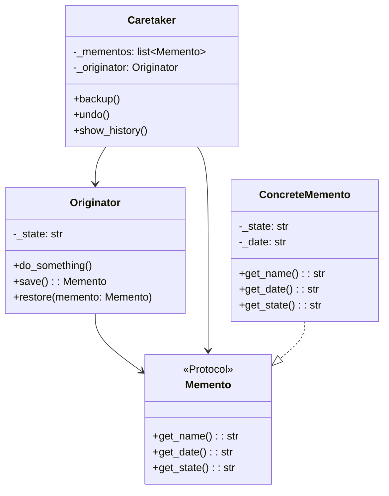

# Memento

**Categoria:** Padrões Comportamentais
**Referência:** https://refactoring.guru/pt-br/design-patterns/memento
**Exemplo Python:** https://refactoring.guru/pt-br/design-patterns/memento/python/example

## Propósito

O Memento é um padrão de projeto comportamental que permite salvar e restaurar o estado anterior de um objeto sem revelar os detalhes de sua implementação.

## Problema

Imagine que você está criando um editor de texto. Além da simples edição, o editor formata texto, insere imagens e executa diversas operações. Em determinado momento você decide permitir que os usuários desfaçam qualquer operação — algo tão comum hoje em dia que as pessoas esperam que toda aplicação o tenha.

A abordagem direta seria expor todo o estado interno do editor para que outro objeto pudesse salvá-lo. Porém, isso quebra o encapsulamento: o caretaker passa a conhecer detalhes que não deveria, dificultando a manutenção e aumentando o acoplamento.

## Como Implementar

1. **Identifique a originadora** — a classe cujo estado precisa ser salvo e restaurado.
2. **Crie o memento** — um objeto imutável que espelha o estado relevante da originadora. Em Python, `@dataclass(frozen=True)` é uma escolha idiomática.
3. **Defina um contrato para o memento** — use um `Protocol` para expor apenas metadados (nome, data) ao caretaker, sem revelar o estado interno da originadora.
4. **Adicione métodos de snapshot na originadora** — `save()` cria um memento; `restore(memento)` restaura o estado a partir dele.
5. **Crie o caretaker** — responsável por guardar a pilha de mementos e decidir quando salvar ou desfazer. Ele trabalha apenas com o protocolo do memento.
6. **No cliente**, crie a originadora e o caretaker, realize alterações, salve estados e restaure quando necessário.

## Relações com Outros Padrões

- **Command e Memento** funcionam bem juntos ao implementar *undo/redo*: o Command executa operações e o Memento salva o estado antes de cada execução.
- **Memento e Iterator** podem ser combinados para capturar e reverter o estado atual de uma iteração.
- **Prototype** pode ser uma alternativa mais simples ao Memento quando basta clonar o objeto completo em vez de armazenar snapshots históricos.
- **State** guarda o estado ativo de um contexto, enquanto **Memento** guarda versões anteriores para restauração.

## Diagrama Mermaid



## Exemplo em Python

```python
from __future__ import annotations

import random
import string
from dataclasses import dataclass, field
from datetime import datetime
from typing import Protocol


class Memento(Protocol):
    """Contrato que expõe apenas metadados do memento ao caretaker."""

    def get_name(self) -> str: ...

    def get_date(self) -> str: ...

    def get_state(self) -> str: ...


@dataclass(frozen=True)
class ConcreteMemento:
    """Snapshot imutável do estado da originadora."""

    _state: str
    _date: str = field(default_factory=lambda: datetime.now().isoformat(timespec="seconds"))

    def get_state(self) -> str:
        """Retorna o estado encapsulado (usado pela originadora na restauração)."""
        return self._state

    def get_name(self) -> str:
        """Identificação amigável usada pelo caretaker."""
        prefix = self._state[:9]
        return f"{self._date} / ({prefix}...)"

    def get_date(self) -> str:
        """Data/hora em que o snapshot foi criado."""
        return self._date


class Originator:
    """Mantém um estado importante e sabe como salvá-lo/restaurá-lo."""

    def __init__(self, state: str) -> None:
        self._state = state
        print(f"Originator: Meu estado inicial é: {state}")

    def do_something(self) -> None:
        """Lógica de negócio que altera o estado interno."""
        print("Originator: Estou fazendo algo importante.")
        self._state = self._generate_random_string(30)
        print(f"Originator: Meu estado mudou para: {self._state}")

    def _generate_random_string(self, length: int = 10) -> str:
        """Gera uma string aleatória para simular uma mudança de estado."""
        chars = string.ascii_letters
        return "".join(random.choice(chars) for _ in range(length))

    def save(self) -> ConcreteMemento:
        """Cria um snapshot do estado atual."""
        return ConcreteMemento(self._state)

    def restore(self, memento: Memento) -> None:
        """Restaura o estado a partir de um memento conhecido."""
        if not isinstance(memento, ConcreteMemento):
            raise ValueError(f"Classe de memento desconhecida: {type(memento).__name__}")

        self._state = memento.get_state()
        print(f"Originator: Meu estado mudou para: {self._state}")


class Caretaker:
    """Gerencia o histórico de mementos sem acessar seu estado interno."""

    def __init__(self, originator: Originator) -> None:
        self._originator = originator
        self._mementos: list[Memento] = []

    def backup(self) -> None:
        print("\nCaretaker: Salvando estado do Originator...")
        self._mementos.append(self._originator.save())

    def undo(self) -> None:
        if not self._mementos:
            return

        memento = self._mementos.pop()
        print(f"Caretaker: Restaurando estado para: {memento.get_name()}")

        try:
            self._originator.restore(memento)
        except ValueError:
            self.undo()

    def show_history(self) -> None:
        print("Caretaker: Lista de mementos:")
        for memento in self._mementos:
            print(memento.get_name())


if __name__ == "__main__":
    originator = Originator("Super-duper-super-puper-super.")
    caretaker = Caretaker(originator)

    caretaker.backup()
    originator.do_something()

    caretaker.backup()
    originator.do_something()

    caretaker.backup()
    originator.do_something()

    print()
    caretaker.show_history()

    print("\nClient: Agora vamos desfazer!\n")
    caretaker.undo()

    print("\n\nClient: Mais uma vez!\n")
    caretaker.undo()
```

### Output

```
Originator: Meu estado inicial é: Super-duper-super-puper-super.

Caretaker: Salvando estado do Originator...
Originator: Estou fazendo algo importante.
Originator: Meu estado mudou para: oGyQIIatlDDWNgYYqJATTmdwnnGZQj

Caretaker: Salvando estado do Originator...
Originator: Estou fazendo algo importante.
Originator: Meu estado mudou para: jBtMDDWogzzRJbTTmEwOOhZrjjBULe

Caretaker: Salvando estado do Originator...
Originator: Estou fazendo algo importante.
Originator: Meu estado mudou para: exoHyyRkbuuNEXOhhArKccUmexPPHZ

Caretaker: Lista de mementos:
2026-07-03T14:12:40 / (Super-dup...)
2026-07-03T14:12:40 / (oGyQIIatl...)
2026-07-03T14:12:40 / (jBtMDDWog...)

Client: Agora vamos desfazer!

Caretaker: Restaurando estado para: 2026-07-03T14:12:40 / (jBtMDDWog...)
Originator: Meu estado mudou para: jBtMDDWogzzRJbTTmEwOOhZrjjBULe


Client: Mais uma vez!

Caretaker: Restaurando estado para: 2026-07-03T14:12:40 / (oGyQIIatl...)
Originator: Meu estado mudou para: oGyQIIatlDDWNgYYqJATTmdwnnGZQj
```
