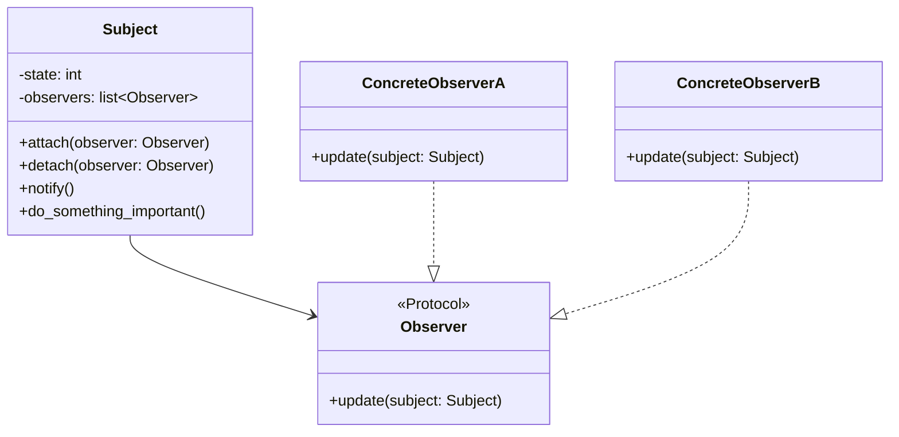

# Observer

**Categoria:** Padrões Comportamentais
**Referência:** https://refactoring.guru/pt-br/design-patterns/observer
**Exemplo Python:** https://refactoring.guru/pt-br/design-patterns/observer/python/example

## Propósito

O Observer é um padrão de projeto comportamental que permite que você defina um mecanismo de assinatura para notificar múltiplos objetos sobre quaisquer eventos que aconteçam com o objeto que eles estão observando.

## Problema

Imagine que você tem dois tipos de objetos: um Cliente e uma Loja. O cliente está muito interessado em uma marca particular de um produto (digamos que seja um novo modelo de iPhone) que logo deverá estar disponível na loja.

O cliente pode visitar a loja todos os dias e checar a disponibilidade do produto. Mas enquanto o produto ainda está a caminho, a maioria dessas visitas serão em vão.

Por outro lado, a loja poderia mandar milhares de e-mails (que poderiam ser considerados spam) para todos os clientes, mesmo quando não há novidades. Isso desperdiça recursos e sobrecarrega os clientes.

A solução é inverter o controle: o cliente se inscreve na loja e recebe uma notificação assim que o produto chega.

## Como Implementar

1. **Analise sua lógica de negócio** e divida-a em duas partes: a funcionalidade principal, independente de outros códigos, atuará como publicadora (*subject*); o restante se transformará em assinantes (*observers*).

2. **Declare o protocolo do assinante**. No mínimo, ele deve declarar um único método `update`. Em Python, um `Protocol` do `typing` costuma ser suficiente.

3. **Declare a interface da publicadora** e descreva métodos para adicionar e remover assinantes da lista. Publicadoras devem trabalhar com assinantes apenas através do protocolo.

4. **Decida onde colocar a lista de assinantes** e a implementação dos métodos de inscrição. Geralmente esse código é idêntico para todos os tipos de publicadoras, então o lugar natural é uma classe base ou mixin.

5. **Crie as publicadoras concretas** e garanta que elas notifiquem os assinantes sempre que seu estado mudar de forma relevante.

6. **Implemente os métodos `update`** nos assinantes concretos. Eles podem receber uma referência à publicadora e ler o estado diretamente dela.

7. **No cliente**, crie a publicadora e os assinantes, registre os assinantes e execute a lógica de negócio para observar as notificações.

## Diagrama Mermaid



## Exemplo em Python

```python
from __future__ import annotations

import random
from typing import Protocol


class Observer(Protocol):
    """Protocolo que define a interface de todos os observadores."""

    def update(self, subject: Subject) -> None:
        """Recebe uma notificação de mudança de estado do sujeito."""
        ...


class Subject:
    """Mantém um estado importante e notifica os observadores quando ele muda."""

    def __init__(self) -> None:
        self._state: int = 0
        self._observers: list[Observer] = []

    @property
    def state(self) -> int:
        """Expõe o estado atual para os observadores."""
        return self._state

    def attach(self, observer: Observer) -> None:
        """Adiciona um observador, se ainda não estiver inscrito."""
        if observer not in self._observers:
            self._observers.append(observer)
            print("Subject: Observador anexado.")

    def detach(self, observer: Observer) -> None:
        """Remove um observador da lista de inscritos."""
        if observer in self._observers:
            self._observers.remove(observer)
            print("Subject: Observador removido.")

    def notify(self) -> None:
        """Dispara a atualização em cada observador inscrito."""
        print("Subject: Notificando observadores...")
        for observer in self._observers:
            observer.update(self)

    def do_something_important(self) -> None:
        """Lógica de negócio que altera o estado e notifica os observadores."""
        print("\nSubject: Estou fazendo algo importante.")
        self._state = random.randint(0, 10)
        print(f"Subject: Meu estado mudou para: {self._state}")
        self.notify()


class ConcreteObserverA:
    """Observador concreto que reage a estados menores que 3."""

    def update(self, subject: Subject) -> None:
        if subject.state < 3:
            print("ConcreteObserverA: Reagiu ao evento.")


class ConcreteObserverB:
    """Observador concreto que reage a estados 0 ou maiores/iguais a 2."""

    def update(self, subject: Subject) -> None:
        if subject.state == 0 or subject.state >= 2:
            print("ConcreteObserverB: Reagiu ao evento.")


if __name__ == "__main__":
    subject = Subject()

    observer_a = ConcreteObserverA()
    subject.attach(observer_a)

    observer_b = ConcreteObserverB()
    subject.attach(observer_b)

    subject.do_something_important()
    subject.do_something_important()

    subject.detach(observer_b)

    subject.do_something_important()
```

### Output

```
Subject: Observador anexado.
Subject: Observador anexado.

Subject: Estou fazendo algo importante.
Subject: Meu estado mudou para: 2
Subject: Notificando observadores...
ConcreteObserverA: Reagiu ao evento.
ConcreteObserverB: Reagiu ao evento.

Subject: Estou fazendo algo importante.
Subject: Meu estado mudou para: 1
Subject: Notificando observadores...
ConcreteObserverA: Reagiu ao evento.
Subject: Observador removido.

Subject: Estou fazendo algo importante.
Subject: Meu estado mudou para: 5
Subject: Notificando observadores...
```

## Relações com Outros Padrões

O **Chain of Responsibility**, **Command**, **Mediator** e **Observer** abordam diferentes formas de conectar remetentes e destinatários de pedidos:

- O **Chain of Responsibility** passa um pedido sequencialmente ao longo de uma corrente dinâmica de potenciais destinatários até que um deles atue no pedido.
- O **Command** estabelece conexões unidirecionais entre remetentes e destinatários.
- O **Mediator** elimina as conexões diretas entre remetentes e destinatários, forçando-os a se comunicar indiretamente através de um objeto mediador.
- O **Observer** permite que destinatários se inscrevam e cancelem a inscrição dinamicamente para receber notificações de um remetente.

A diferença entre o **Mediator** e o **Observer** pode ser sutil: em muitas implementações do Mediator, a comunicação é centralizada em um único objeto, enquanto no Observer a publicadora se comunica diretamente com seus assinantes.

