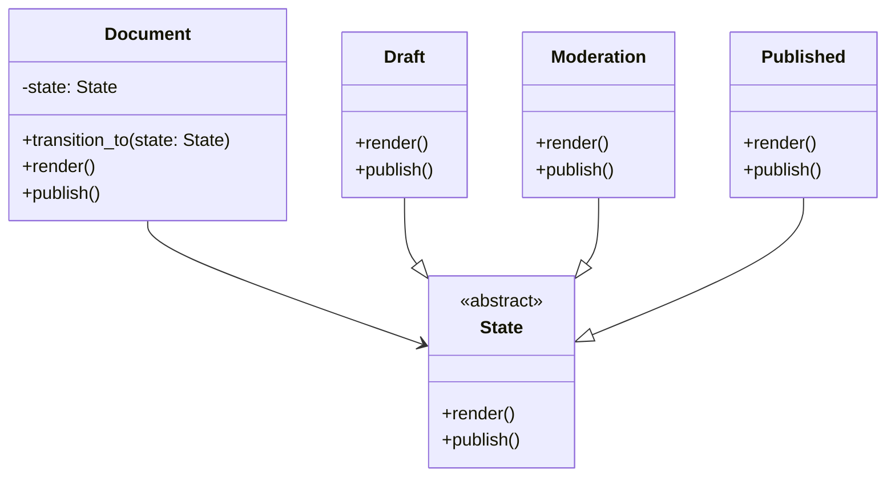

# State

**Categoria:** Padrões Comportamentais
**Referência:** https://refactoring.guru/pt-br/design-patterns/state
**Exemplo Python:** https://refactoring.guru/pt-br/design-patterns/state/python/example

## Propósito

O State é um padrão de projeto comportamental que permite que um objeto altere seu comportamento quando seu estado interno muda. Parece como se o objeto mudasse de classe.

## Problema

O padrão State está intimamente relacionado ao conceito de Máquina de Estado Finito. Em qualquer momento, um programa pode estar em um número finito de estados; dentro de cada estado, ele se comporta de forma diferente e pode ou não transitar para outros estados dependendo do estado atual.

Sem o padrão, essa lógica costuma ficar espalhada em grandes blocos `if/elif/else` ou `match/case` dentro do próprio contexto. Toda vez que um novo estado é adicionado, vários métodos do contexto precisam ser alterados, violando o princípio aberto/fechado e dificultando a manutenção.

## Como Implementar

1. Identifique a classe que atuará como **contexto**. Geralmente é a classe que possui a lógica condicional dependente de estado.
2. Declare a **interface do estado** com os métodos que o contexto delegará. Em Python, isso pode ser um `Protocol` ou uma `abc.ABC` com `@abstractmethod`.
3. Crie uma classe concreta para cada estado. Extraia do contexto todo o comportamento específico daquele estado.
4. Dê aos estados uma referência de volta para o contexto (back-reference) quando precisarem de dados do contexto ou quando precisarem disparar transições.
5. No contexto, mantenha uma referência ao estado atual e delegue as chamadas dos métodos afetados para ele.
6. Forneça um método `transition_to` para trocar o estado em tempo de execução.

## Relações com Outros Padrões

- O **Bridge**, **State**, **Strategy** e, em certa medida, o **Adapter** possuem estruturas muito parecidas, baseadas em composição. A diferença está no problema que cada um resolve.
- O **State** pode ser visto como uma extensão do **Strategy**: ambos usam composição para alterar comportamento em tempo de execução, mas o State modela transições entre estados, enquanto o Strategy escolhe algoritmos de forma independente.
- O **State** frequentemente é usado junto com **Memento** para salvar e restaurar o estado anterior de um objeto.

## Diagrama



## Exemplo em Python

```python
from __future__ import annotations

from abc import ABC, abstractmethod


class Document:
    """Contexto que muda de comportamento conforme o estado atual."""

    def __init__(self) -> None:
        self._state: State = Draft(self)

    def transition_to(self, state: State) -> None:
        """Troca o estado atual do documento."""
        print(f"Documento: transição de {self._state.name} para {state.name}.")
        self._state = state
        state.document = self

    @property
    def state_name(self) -> str:
        return self._state.name

    def render(self) -> None:
        self._state.render()

    def publish(self) -> None:
        self._state.publish()


class State(ABC):
    name: str

    def __init__(self, document: Document | None = None) -> None:
        self.document = document

    @abstractmethod
    def render(self) -> None:
        ...

    @abstractmethod
    def publish(self) -> None:
        ...


class Draft(State):
    """Estado inicial: o documento ainda está sendo escrito."""

    name = "Rascunho"

    def render(self) -> None:
        print("Renderizando documento em modo de edição (preview).")

    def publish(self) -> None:
        print("Enviando documento para moderação.")
        self.document.transition_to(Moderation(self.document))


class Moderation(State):
    """Estado intermediário: o documento aguarda aprovação."""

    name = "Moderação"

    def render(self) -> None:
        print("Renderizando documento em modo de revisão (apenas revisores).")

    def publish(self) -> None:
        print("Documento aprovado e publicado.")
        self.document.transition_to(Published(self.document))


class Published(State):
    """Estado final: o documento está publicado e visível."""

    name = "Publicado"

    def render(self) -> None:
        print("Renderizando documento publicado (visível para todos).")

    def publish(self) -> None:
        print("O documento já está publicado.")


if __name__ == "__main__":
    doc = Document()
    print(f"Estado atual: {doc.state_name}")
    doc.render()
    doc.publish()
    print(f"\nEstado atual: {doc.state_name}")
    doc.render()
    doc.publish()
    print(f"\nEstado atual: {doc.state_name}")
    doc.render()
    doc.publish()
```

### Output

```text
Estado atual: Rascunho
Renderizando documento em modo de edição (preview).
Enviando documento para moderação.
Documento: transição de Rascunho para Moderação.

Estado atual: Moderação
Renderizando documento em modo de revisão (apenas revisores).
Documento aprovado e publicado.
Documento: transição de Moderação para Publicado.

Estado atual: Publicado
Renderizando documento publicado (visível para todos).
O documento já está publicado.
```
