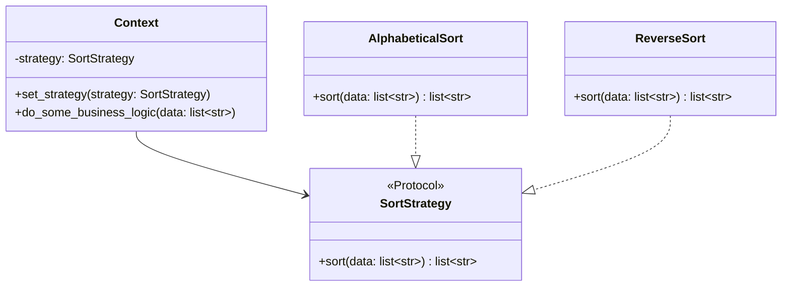

# Strategy

**Categoria:** Padrões Comportamentais
**Referência:** https://refactoring.guru/pt-br/design-patterns/strategy

## Propósito

O Strategy é um padrão de projeto comportamental que permite que você defina uma família de algoritmos, coloque-os em classes separadas, e faça os objetos deles intercambiáveis.

## Problema

Imagine uma aplicação de navegação para viajantes casuais. A aplicação exibia um mapa bonito e uma das funcionalidades mais pedidas era o planejamento automático de rotas: o usuário digitava um endereço e via a melhor rota no mapa.

A primeira versão só calculava rotas sobre rodovias, o que agradou quem viaja de carro. Com o tempo, surgiram pedidos para rotas de bicicleta, transporte público e pedestres. Se todos os algoritmos ficassem na mesma classe principal, cada nova variante exigiria modificar código já existente, aumentando a complexidade e dificultando a manutenção.

## Como Implementar

1. Na classe contexto, identifique um algoritmo que muda com frequência ou uma grande condicional que escolhe variantes do mesmo algoritmo em runtime.
2. Declare um contrato comum para todas as variantes do algoritmo. Em Python, `Protocol` costuma ser mais idiomático do que uma classe abstrata obrigatória.
3. Extraia cada algoritmo para sua própria classe (ou função) que satisfaça o contrato da estratégia.
4. No contexto, mantenha uma referência à estratégia atual e ofereça uma forma de trocá-la em runtime.
5. Os clientes associam o contexto com a estratégia desejada.

## Relações com Outros Padrões

- **Bridge, State, Strategy e Adapter** têm estruturas muito parecidas, baseadas em composição. Contudo, todos resolvem problemas distintos; a estrutura semelhante comunica a intenção, não apenas a forma.
- **Command e Strategy** podem parecer similares porque ambos parametrizam objetos com ações. A diferença é que o Command encapsula um pedido como um objeto autônomo (com undo/redo, fila etc.), enquanto o Strategy muda o núcleo de como o contexto realiza seu trabalho.
- **Decorator** altera a "pele" de um objeto, mantendo a mesma interface; o Strategy altera o "interior", trocando o algoritmo interno.
- **Template Method e Strategy** lidam com variantes de algoritmos. Template Method usa herança e define o esqueleto do algoritmo na classe base; Strategy usa composição e troca o algoritmo inteiro em runtime.

## Diagrama



## Exemplo em Python

```python
from typing import Protocol


class SortStrategy(Protocol):
    """Contrato comum a todas as estratégias de ordenação."""

    def sort(self, data: list[str]) -> list[str]:
        ...


class AlphabeticalSort:
    """Ordena os dados em ordem alfabética crescente."""

    def sort(self, data: list[str]) -> list[str]:
        return sorted(data)


class ReverseSort:
    """Ordena os dados em ordem alfabética decrescente."""

    def sort(self, data: list[str]) -> list[str]:
        return sorted(data, reverse=True)


class Context:
    """Mantém uma referência à estratégia e delega o trabalho a ela."""

    def __init__(self, strategy: SortStrategy) -> None:
        self._strategy = strategy

    def set_strategy(self, strategy: SortStrategy) -> None:
        """Permite trocar a estratégia em runtime."""
        self._strategy = strategy

    def do_some_business_logic(self, data: list[str]) -> None:
        print("Context: Ordenando dados usando a estratégia atual")
        result = self._strategy.sort(data)
        print(",".join(result))


if __name__ == "__main__":
    # O cliente escolhe uma estratégia concreta e a passa ao contexto.
    context = Context(AlphabeticalSort())
    print("Cliente: Estratégia definida para ordenação normal.")
    context.do_some_business_logic(["d", "a", "c", "e", "b"])

    print()

    print("Cliente: Estratégia definida para ordenação reversa.")
    context.set_strategy(ReverseSort())
    context.do_some_business_logic(["d", "a", "c", "e", "b"])
```

### Output

```
Cliente: Estratégia definida para ordenação normal.
Context: Ordenando dados usando a estratégia atual
a,b,c,d,e

Cliente: Estratégia definida para ordenação reversa.
Context: Ordenando dados usando a estratégia atual
e,d,c,b,a
```
