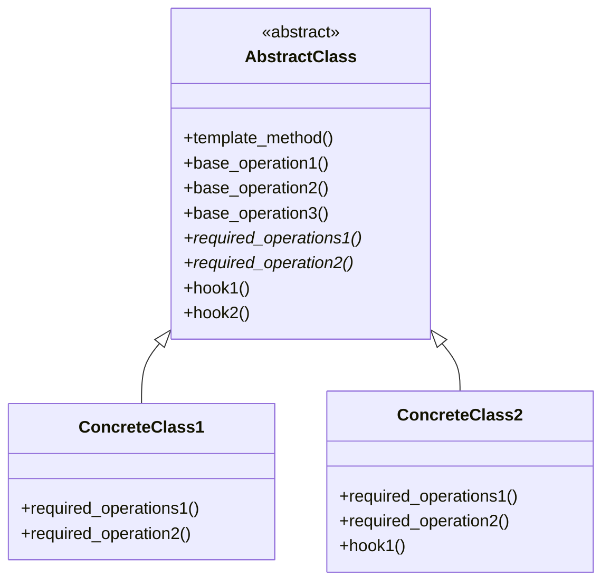

# Template Method

**Categoria:** Padrões Comportamentais
**Referência:** https://refactoring.guru/pt-br/design-patterns/template-method
**Exemplo Python:** https://refactoring.guru/pt-br/design-patterns/template-method/python/example

## Propósito

O Template Method é um padrão de projeto comportamental que define o esqueleto de um algoritmo na superclasse mas deixa as subclasses sobrescreverem etapas específicas do algoritmo sem modificar sua estrutura.

## Problema

Imagine que você está criando uma aplicação de mineração de dados que analisa documentos corporativos. Os usuários alimentam a aplicação com documentos em vários formatos (PDF, DOC, CSV), e ela tenta extrair dados significativos desses documentos para um formato uniforme.
A primeira versão da aplicação podia funcionar somente com arquivos DOC. Na versão seguinte, ela era capaz de suportar arquivos CSV. Um mês depois, você a "ensinou" a extrair dados de arquivos PDF.
Em algum momento você percebe que as classes compartilham muito código: abrir o arquivo, ler metadados, normalizar o texto e salvar o resultado. Cada novo formato exige copiar e colar esse esqueleto e alterar apenas alguns passos. O Template Method resolve isso ao centralizar a sequência comum na classe base e permitir que cada formato redefina apenas os passos específicos.

## Como Implementar

1. **Analise o algoritmo alvo** para ver se você quer quebrá-lo em etapas. Considere quais etapas são comuns a todas as subclasses e quais permanecerão únicas.

2. **Crie a classe abstrata base** e declare o método padrão (*template method*) e o conjunto de métodos abstratos representando as etapas do algoritmo. Contorne a estrutura do algoritmo no método padrão ao executar as etapas correspondentes.

3. **Tudo bem se todas as etapas terminarem sendo abstratas.** Contudo, alguns passos podem se beneficiar de ter uma implementação padrão. Subclasses não têm que implementar esses métodos.

4. **Pense em adicionar ganchos (*hooks*)** entre as etapas cruciais do algoritmo. Eles permitem que subclasses opcionalmente estendam o comportamento sem quebrar o esqueleto.

5. **Para cada variação do algoritmo, crie uma nova subclasse concreta.** Ela deve implementar todas as operações abstratas e pode sobrescrever ganchos quando necessário.

## Relações com Outros Padrões

- O **Factory Method** é uma especialização do **Template Method**. Ao mesmo tempo, o Factory Method pode servir como uma etapa em um Template Method maior.
- O **Template Method** é baseado em herança: ele permite que você altere partes de um algoritmo ao estender essas partes em subclasses. O **Strategy** é baseado em composição: você pode alterar partes do comportamento de um objeto ao fornecer diferentes estratégias que correspondem a aquele comportamento. O Template Method funciona a nível de classe, enquanto o Strategy funciona a nível de objeto.
- O **Template Method** pode usar o **Hook** para permitir que subclasses personalizem pontos específicos do algoritmo sem modificar sua estrutura principal.

## Diagrama



## Exemplo em Python

```python
from abc import ABC, abstractmethod


class AbstractClass(ABC):
    """
    Classe abstrata que define o template method contendo o esqueleto de um
    algoritmo, composto por chamadas a operações primitivas (geralmente
    abstratas).

    As subclasses concretas devem implementar essas operações, mas nunca
    devem modificar o template method em si.
    """

    def template_method(self) -> None:
        """Define o esqueleto do algoritmo."""
        self.base_operation1()
        self.required_operations1()
        self.base_operation2()
        self.hook1()
        self.required_operation2()
        self.base_operation3()
        self.hook2()

    # Operações que já possuem implementação padrão.
    def base_operation1(self) -> None:
        print("AbstractClass diz: estou fazendo a maior parte do trabalho")

    def base_operation2(self) -> None:
        print("AbstractClass diz: mas deixo subclasses sobrescreverem algumas operações")

    def base_operation3(self) -> None:
        print("AbstractClass diz: mas estou fazendo a maior parte do trabalho mesmo assim")

    # Operações que devem ser implementadas pelas subclasses.
    @abstractmethod
    def required_operations1(self) -> None:
        ...

    @abstractmethod
    def required_operation2(self) -> None:
        ...

    # Ganchos (hooks): subclasses podem sobrescrevê-los, mas não é obrigatório,
    # pois já possuem uma implementação padrão vazia. Eles oferecem pontos de
    # extensão adicionais em lugares cruciais do algoritmo.
    def hook1(self) -> None:
        pass

    def hook2(self) -> None:
        pass


class ConcreteClass1(AbstractClass):
    """Classe concreta que implementa todas as operações abstratas da base."""

    def required_operations1(self) -> None:
        print("ConcreteClass1 diz: Implementou a Operação1")

    def required_operation2(self) -> None:
        print("ConcreteClass1 diz: Implementou a Operação2")


class ConcreteClass2(AbstractClass):
    """
    Normalmente, classes concretas sobrescrevem apenas uma fração das
    operações da classe base.
    """

    def required_operations1(self) -> None:
        print("ConcreteClass2 diz: Implementou a Operação1")

    def required_operation2(self) -> None:
        print("ConcreteClass2 diz: Implementou a Operação2")

    def hook1(self) -> None:
        print("ConcreteClass2 diz: Sobrescreveu o Hook1")


def client_code(abstract_class: AbstractClass) -> None:
    """
    Código cliente que chama o template method para executar o algoritmo.
    Não precisa conhecer a classe concreta do objeto, desde que trabalhe com
    ele através da interface da classe base.
    """
    abstract_class.template_method()


if __name__ == "__main__":
    print("Mesmo código cliente pode trabalhar com diferentes subclasses:\n")
    client_code(ConcreteClass1())
    print()
    print("Mesmo código cliente pode trabalhar com diferentes subclasses:\n")
    client_code(ConcreteClass2())
```

### Output

```
Mesmo código cliente pode trabalhar com diferentes subclasses:

AbstractClass diz: estou fazendo a maior parte do trabalho
ConcreteClass1 diz: Implementou a Operação1
AbstractClass diz: mas deixo subclasses sobrescreverem algumas operações
ConcreteClass1 diz: Implementou a Operação2
AbstractClass diz: mas estou fazendo a maior parte do trabalho mesmo assim

Mesmo código cliente pode trabalhar com diferentes subclasses:

AbstractClass diz: estou fazendo a maior parte do trabalho
ConcreteClass2 diz: Implementou a Operação1
AbstractClass diz: mas deixo subclasses sobrescreverem algumas operações
ConcreteClass2 diz: Sobrescreveu o Hook1
ConcreteClass2 diz: Implementou a Operação2
AbstractClass diz: mas estou fazendo a maior parte do trabalho mesmo assim
```
