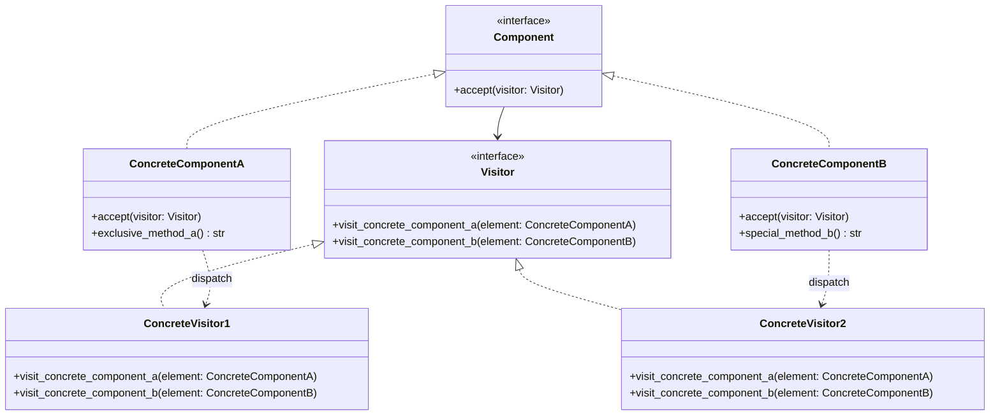

# Visitor

**Categoria:** Padrões Comportamentais
**Referência:** https://refactoring.guru/pt-br/design-patterns/visitor

## Propósito

O Visitor é um padrão de projeto comportamental que permite que você separe algoritmos dos objetos nos quais eles operam.

## Problema

Imagine que você precisa executar uma operação sobre todos os elementos de uma estrutura de objetos complexa — por exemplo, exportar cada nó de uma árvore de documentos para XML. Inicialmente a operação pode ser implementada dentro das próprias classes dos nós, mas, a cada novo comportamento (exportar para JSON, validar, renderizar), você teria que alterar todas as classes. O Visitor permite adicionar novos algoritmos sem modificar as classes existentes, ao custo de o visitante conhecer os tipos concretos dos elementos.

## Como Implementar

1. Declare a interface `Visitor` com um método `visit_*` para cada classe elemento concreta do programa.
2. Declare a interface `Component` com um método `accept(visitor: Visitor)`.
3. Cada classe concreta implementa `accept` redirecionando a chamada para o método `visit_` correspondente do visitante.
4. Implemente visitantes concretos com os algoritmos desejados; eles podem acessar métodos específicos de cada elemento.
5. O cliente percorre a estrutura e chama `accept(visitor)` sem precisar saber os tipos concretos dos elementos.

## Relações com Outros Padrões

- Você pode tratar o Visitor como uma versão poderosa do **Command**, pois seus objetos executam operações sobre vários objetos de classes diferentes.
- O Visitor pode percorrer e operar sobre uma árvore **Composite** inteira.
- Combine Visitor com **Iterator** para percorrer estruturas complexas e executar operações sobre elementos de classes distintas.

## Diagrama



## Exemplo em Python

```python
from abc import ABC, abstractmethod


class Visitor(ABC):
    """Declara um método visitante para cada classe elemento concreta."""

    @abstractmethod
    def visit_concrete_component_a(self, element: "ConcreteComponentA") -> None:
        ...

    @abstractmethod
    def visit_concrete_component_b(self, element: "ConcreteComponentB") -> None:
        ...


class Component(ABC):
    """Declara o método accept, que recebe um visitante."""

    @abstractmethod
    def accept(self, visitor: Visitor) -> None:
        ...


class ConcreteComponentA(Component):
    def accept(self, visitor: Visitor) -> None:
        # Redireciona para o método que corresponde a esta classe concreta.
        visitor.visit_concrete_component_a(self)

    def exclusive_method_of_concrete_component_a(self) -> str:
        return "A"


class ConcreteComponentB(Component):
    def accept(self, visitor: Visitor) -> None:
        visitor.visit_concrete_component_b(self)

    def special_method_of_concrete_component_b(self) -> str:
        return "B"


class ConcreteVisitor1(Visitor):
    def visit_concrete_component_a(self, element: ConcreteComponentA) -> None:
        print(f"{element.exclusive_method_of_concrete_component_a()} + ConcreteVisitor1")

    def visit_concrete_component_b(self, element: ConcreteComponentB) -> None:
        print(f"{element.special_method_of_concrete_component_b()} + ConcreteVisitor1")


class ConcreteVisitor2(Visitor):
    def visit_concrete_component_a(self, element: ConcreteComponentA) -> None:
        print(f"{element.exclusive_method_of_concrete_component_a()} + ConcreteVisitor2")

    def visit_concrete_component_b(self, element: ConcreteComponentB) -> None:
        print(f"{element.special_method_of_concrete_component_b()} + ConcreteVisitor2")


def client_code(components: list[Component], visitor: Visitor) -> None:
    """Executa o visitante sobre todos os elementos sem conhecer suas classes concretas."""
    for component in components:
        component.accept(visitor)


if __name__ == "__main__":
    components: list[Component] = [
        ConcreteComponentA(),
        ConcreteComponentB(),
    ]

    print("O cliente funciona com todos os visitantes via a interface Visitor:")
    client_code(components, ConcreteVisitor1())

    print()

    print("O mesmo código cliente funciona com diferentes tipos de visitantes:")
    client_code(components, ConcreteVisitor2())
```

### Output

```
O cliente funciona com todos os visitantes via a interface Visitor:
A + ConcreteVisitor1
B + ConcreteVisitor1

O mesmo código cliente funciona com diferentes tipos de visitantes:
A + ConcreteVisitor2
B + ConcreteVisitor2
```
