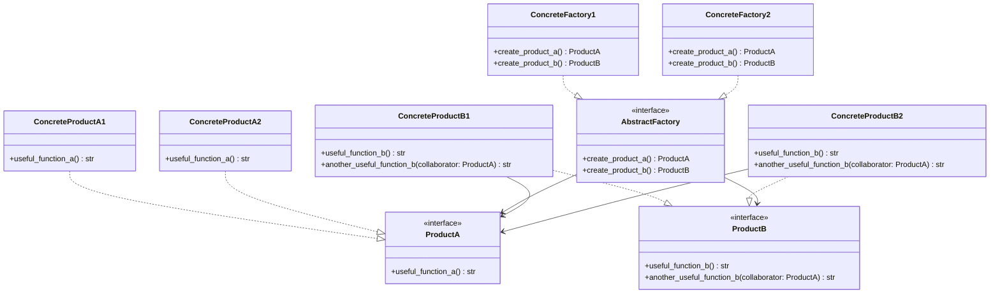

# Abstract Factory

**Categoria:** Padrões Criacionais
**Referência:** https://refactoring.guru/pt-br/design-patterns/abstract-factory
**Exemplo Python:** https://refactoring.guru/pt-br/design-patterns/abstract-factory/python/example

## Propósito

O Abstract Factory é um padrão de projeto criacional que permite produzir famílias de objetos relacionados sem especificar suas classes concretas.

## Problema

Imagine que você está criando um simulador de loja de móveis. Seu código precisa representar famílias de produtos relacionados, como `Cadeira + Sofa + MesaDeCentro`, e cada família possui variantes distintas: Moderno, Vitoriano, ArtDeco.

Você precisa criar objetos de móveis individuais de forma que eles combinem com outros objetos da mesma família. Os clientes ficam frustrados quando recebem uma mesa ArtDeco acompanhada de um sofá Vitoriano. O Abstract Factory resolve esse problema garantindo que todos os objetos criados por uma mesma fábrica sejam compatíveis entre si.

## Como Implementar

1. Mapeie os tipos de produtos distintos e as variantes que cada família deve oferecer.
2. Defina interfaces abstratas (em Python, `Protocol` ou `abc.ABC`) para cada tipo de produto.
3. Implemente classes concretas de produtos para cada variante.
4. Declare a interface da fábrica abstrata com métodos de criação para todos os produtos.
5. Crie fábricas concretas, uma para cada variante, que produzam apenas produtos compatíveis.
6. No código cliente, receba a fábrica através da interface abstrata e use-a para criar produtos sem conhecer as classes concretas.
7. Substitua chamadas diretas a construtores de produtos por chamadas aos métodos da fábrica.

## Relações com Outros Padrões

Muitos projetos começam usando o **Factory Method** (mais simples e customizável via subclasses) e evoluem para o **Abstract Factory**, **Prototype** ou **Builder** (mais flexíveis, porém mais complexos).

O **Builder** foca em construir objetos complexos passo a passo. O **Abstract Factory** se especializa em criar famílias de objetos relacionados. A diferença principal é que o Abstract Factory retorna o produto imediatamente, enquanto o Builder permite executar etapas de construção antes de obter o resultado final.

## Diagrama Mermaid



## Exemplo em Python

```python
from typing import Protocol


# Protocolos que representam os produtos abstratos da família.
class ProductA(Protocol):
    def useful_function_a(self) -> str: ...


class ProductB(Protocol):
    def useful_function_b(self) -> str: ...
    def another_useful_function_b(self, collaborator: ProductA) -> str: ...


# Protocolo da fábrica abstrata.
class AbstractFactory(Protocol):
    def create_product_a(self) -> ProductA: ...
    def create_product_b(self) -> ProductB: ...


# Produtos concretos da primeira variante.
class ConcreteProductA1:
    def useful_function_a(self) -> str:
        return "O resultado do produto A1."


class ConcreteProductB1:
    def useful_function_b(self) -> str:
        return "O resultado do produto B1."

    def another_useful_function_b(self, collaborator: ProductA) -> str:
        result = collaborator.useful_function_a()
        return f"O resultado do B1 colaborando com o ({result})"


# Produtos concretos da segunda variante.
class ConcreteProductA2:
    def useful_function_a(self) -> str:
        return "O resultado do produto A2."


class ConcreteProductB2:
    def useful_function_b(self) -> str:
        return "O resultado do produto B2."

    def another_useful_function_b(self, collaborator: ProductA) -> str:
        result = collaborator.useful_function_a()
        return f"O resultado do B2 colaborando com o ({result})"


# Fábricas concretas: cada uma produz uma família compatível de objetos.
class ConcreteFactory1:
    def create_product_a(self) -> ProductA:
        return ConcreteProductA1()

    def create_product_b(self) -> ProductB:
        return ConcreteProductB1()


class ConcreteFactory2:
    def create_product_a(self) -> ProductA:
        return ConcreteProductA2()

    def create_product_b(self) -> ProductB:
        return ConcreteProductB2()


# Código cliente que trabalha apenas com as abstrações.
def client_code(factory: AbstractFactory) -> None:
    product_a = factory.create_product_a()
    product_b = factory.create_product_b()
    print(product_b.useful_function_b())
    print(product_b.another_useful_function_b(product_a))


if __name__ == "__main__":
    print("Cliente: testando o código com a primeira fábrica...")
    client_code(ConcreteFactory1())
    print()
    print("Cliente: testando o mesmo código com a segunda fábrica...")
    client_code(ConcreteFactory2())
```

## Output

```
Cliente: testando o código com a primeira fábrica...
O resultado do produto B1.
O resultado do B1 colaborando com o (O resultado do produto A1.)

Cliente: testando o mesmo código com a segunda fábrica...
O resultado do produto B2.
O resultado do B2 colaborando com o (O resultado do produto A2.)
```
