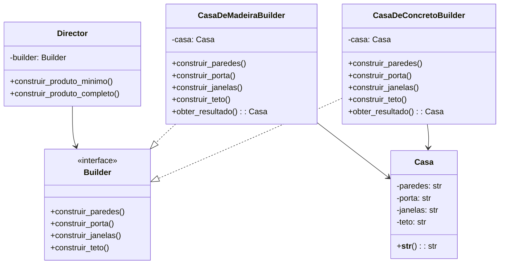

# Builder

**Categoria:** Padrões Criacionais
**Referência:** https://refactoring.guru/pt-br/design-patterns/builder
**Exemplo Python:** https://refactoring.guru/pt-br/design-patterns/builder/python/example

## Propósito

O Builder é um padrão de projeto criacional que permite construir objetos complexos passo a passo, produzindo diferentes representações do mesmo objeto sem duplicar o código de construção.

## Problema

Imagine um objeto complexo que exige uma inicialização trabalhosa, com muitos campos e objetos agrupados. Esse código de inicialização costuma ficar enterrado dentro de um construtor enorme com dezenas de parâmetros, ou espalhado pelo código cliente.

Por exemplo, para criar uma `Casa` simples você precisa construir paredes, piso, porta, janelas e teto. Para uma casa mais sofisticada ainda entram garagem, jardim, piscina e sistema de segurança. Colocar tudo isso em um único construtor torna o código difícil de ler, testar e manter.

## Como Implementar

1. Defina claramente as etapas comuns de construção para todas as representações do produto.
2. Declare essas etapas em uma interface base — em Python, um `Protocol` costuma ser suficiente.
3. Crie builders concretos para cada representação do produto e implemente as etapas de construção.
4. Implemente um método para recuperar o resultado. Normalmente ele não faz parte do protocolo base, porque diferentes builders podem produzir produtos sem interface comum.
5. (Opcional) Crie uma classe `Director` que encapsule sequências específicas de passos para produzir variações prontas do produto.
6. O cliente pode usar o `Director` para construir variações padrão, ou controlar o builder diretamente para personalizações.

## Relações com Outros Padrões

- Muitos projetos começam com **Factory Method** e evoluem para **Abstract Factory**, **Prototype** ou **Builder** conforme a complexidade aumenta.
- O **Builder** foca em construir objetos complexos passo a passo. O **Abstract Factory** se especializa em criar famílias de objetos relacionados e retorna o produto imediatamente, enquanto o Builder permite executar etapas intermediárias antes de recuperar o produto.
- O **Builder** pode ser combinado com **Bridge**: o director pode usar diferentes builders para construir partes de uma abstração cuja implementação varia.
- **Composite** pode representar o produto final quando o objeto construído é uma árvore.

## Diagrama Mermaid



## Exemplo em Python

```python
from __future__ import annotations

from dataclasses import dataclass, field
from typing import Protocol


@dataclass
class Casa:
    """Produto final construído passo a passo."""

    paredes: str = "nenhuma"
    porta: str = "nenhuma"
    janelas: str = "nenhuma"
    teto: str = "nenhum"

    def __str__(self) -> str:
        return (
            f"Casa com paredes de {self.paredes}, "
            f"porta de {self.porta}, "
            f"janelas de {self.janelas} e "
            f"teto de {self.teto}"
        )


class Builder(Protocol):
    """Define as etapas comuns de construção de uma casa."""

    def construir_paredes(self) -> None: ...
    def construir_porta(self) -> None: ...
    def construir_janelas(self) -> None: ...
    def construir_teto(self) -> None: ...


class CasaDeMadeiraBuilder:
    """Builder concreto para casas de madeira."""

    def __init__(self) -> None:
        self._casa = Casa()

    def reset(self) -> None:
        self._casa = Casa()

    def construir_paredes(self) -> None:
        self._casa.paredes = "madeira"

    def construir_porta(self) -> None:
        self._casa.porta = "madeira"

    def construir_janelas(self) -> None:
        self._casa.janelas = "vidro com moldura de madeira"

    def construir_teto(self) -> None:
        self._casa.teto = "telha de barro"

    def obter_resultado(self) -> Casa:
        """Devolve a casa construída e reinicia o builder."""
        resultado = self._casa
        self.reset()
        return resultado


class CasaDeConcretoBuilder:
    """Builder concreto para casas de concreto."""

    def __init__(self) -> None:
        self._casa = Casa()

    def reset(self) -> None:
        self._casa = Casa()

    def construir_paredes(self) -> None:
        self._casa.paredes = "concreto"

    def construir_porta(self) -> None:
        self._casa.porta = "aço"

    def construir_janelas(self) -> None:
        self._casa.janelas = "vidro temperado"

    def construir_teto(self) -> None:
        self._casa.teto = "laje"

    def obter_resultado(self) -> Casa:
        resultado = self._casa
        self.reset()
        return resultado


class Diretor:
    """Define sequências comuns de construção."""

    def __init__(self, builder: Builder) -> None:
        self._builder = builder

    def construir_casa_basica(self) -> None:
        self._builder.construir_paredes()
        self._builder.construir_porta()

    def construir_casa_completa(self) -> None:
        self._builder.construir_paredes()
        self._builder.construir_porta()
        self._builder.construir_janelas()
        self._builder.construir_teto()


if __name__ == "__main__":
    # Uso com Director para produzir variações padrão.
    builder_madeira = CasaDeMadeiraBuilder()
    diretor = Diretor(builder_madeira)

    print("Casa básica de madeira:")
    diretor.construir_casa_basica()
    print(builder_madeira.obter_resultado())

    print("\nCasa completa de madeira:")
    diretor.construir_casa_completa()
    print(builder_madeira.obter_resultado())

    # Uso direto do builder, sem Director, para uma configuração customizada.
    print("\nCasa customizada de concreto:")
    builder_concreto = CasaDeConcretoBuilder()
    builder_concreto.construir_paredes()
    builder_concreto.construir_janelas()
    print(builder_concreto.obter_resultado())
```

### Output

```
Casa básica de madeira:
Casa com paredes de madeira, porta de madeira, janelas de nenhuma e teto de nenhum

Casa completa de madeira:
Casa com paredes de madeira, porta de madeira, janelas de vidro com moldura de madeira e teto de telha de barro

Casa customizada de concreto:
Casa com paredes de concreto, porta de nenhuma, janelas de vidro temperado e teto de nenhum
```
