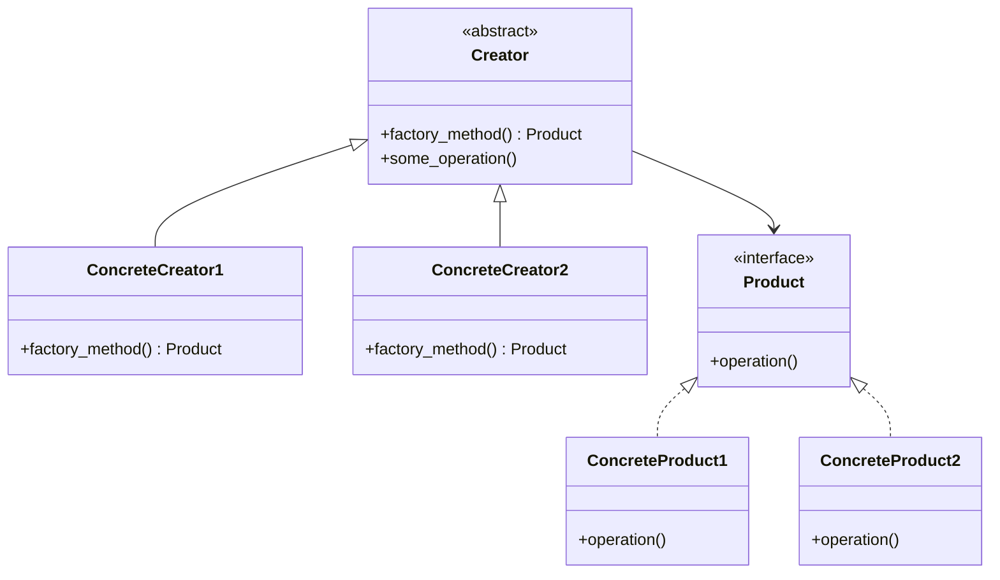

# Factory Method

**Categoria:** Padrões Criacionais
**Referência:** https://refactoring.guru/pt-br/design-patterns/factory-method
**Exemplo Python:** https://refactoring.guru/pt-br/design-patterns/factory-method/python/example

## Propósito

O Factory Method é um padrão criacional de projeto que fornece uma interface para criar objetos em uma superclasse, mas permite que as subclasses alterem o tipo de objetos que serão criados.

## Problema

Imagine que você está criando uma aplicação de gerenciamento de logística. A primeira versão lida apenas com transporte por caminhão, então a maior parte do código fica presa à classe `Caminhao`. Depois que o aplicativo se populariza, surgem pedidos para suportar transporte marítimo. O problema é que o código cliente já chama diretamente `Caminhao()`, e adicionar `Navio()` exige espalhar `if/else` por toda a base de código. Cada novo transporte torna o sistema mais rígido e difícil de estender.

## Como Implementar

1. **Defina uma interface comum para todos os produtos.** Em Python, isso pode ser um `Protocol` ou uma classe abstrata com `abc.ABC`. Todos os produtos concretos devem respeitar essa interface.

2. **Crie uma classe criadora base.** Declare um *factory method* abstrato que retorne o tipo comum do produto. A criadora também pode conter a lógica de negócio que consome o produto.

3. **Implemente criadoras concretas.** Cada subclasse sobrescreve o *factory method* para devolver um produto específico.

4. **Substitua construtores diretos por chamadas ao factory method.** O código cliente passa a depender da criadora abstrata, não das classes concretas.

5. **Adicione novos produtos apenas criando novas subclasses.** O código existente permanece inalterado, respeitando o *Open/Closed Principle*.

## Relações com Outros Padrões

- Muitos projetos começam usando o **Factory Method** (menos complicado e customizável por subclasses) e evoluem para **Abstract Factory**, **Prototype** ou **Builder** (mais flexíveis, mas mais complexos).
- Classes **Abstract Factory** são quase sempre baseadas em um conjunto de métodos fábrica.
- É possível usar **Factory Method** junto com **Iterator** para permitir que coleções de subclasses retornem diferentes tipos de iteradores compatíveis.

## Diagrama



## Exemplo em Python

```python
from abc import ABC, abstractmethod


class Product(ABC):
    """Interface comum a todos os produtos criados pelas fábricas."""

    @abstractmethod
    def operation(self) -> str:
        """Retorna o resultado da operação do produto."""
        ...


class ConcreteProduct1(Product):
    """Primeira variação concreta do produto."""

    def operation(self) -> str:
        return "{Resultado do ConcreteProduct1}"


class ConcreteProduct2(Product):
    """Segunda variação concreta do produto."""

    def operation(self) -> str:
        return "{Resultado do ConcreteProduct2}"


class Creator(ABC):
    """
    Criadora abstrata.

    Declara o factory method e encapsula a lógica de negócio que depende do
    produto retornado. As subclasses alteram o tipo de produto sem modificar
    esse comportamento.
    """

    @abstractmethod
    def factory_method(self) -> Product:
        """Cria e retorna um produto concreto."""
        ...

    def some_operation(self) -> str:
        """Lógica de negócio que consome o produto criado pelo factory method."""
        product = self.factory_method()
        return (
            "Creator: O mesmo código da criadora acabou de trabalhar com "
            f"{product.operation()}"
        )


class ConcreteCreator1(Creator):
    """Criadora concreta que produz ConcreteProduct1."""

    def factory_method(self) -> Product:
        return ConcreteProduct1()


class ConcreteCreator2(Creator):
    """Criadora concreta que produz ConcreteProduct2."""

    def factory_method(self) -> Product:
        return ConcreteProduct2()


def client_code(creator: Creator) -> None:
    """
    Código cliente que trabalha com qualquer criadora através da interface
    abstrata. Não precisa saber qual produto concreto será criado.
    """
    print("Client: Não sei qual criadora está sendo usada, mas funciona.")
    print(creator.some_operation())


if __name__ == "__main__":
    print("App: Iniciado com ConcreteCreator1.")
    client_code(ConcreteCreator1())
    print()

    print("App: Iniciado com ConcreteCreator2.")
    client_code(ConcreteCreator2())
```

### Output

```
App: Iniciado com ConcreteCreator1.
Client: Não sei qual criadora está sendo usada, mas funciona.
Creator: O mesmo código da criadora acabou de trabalhar com {Resultado do ConcreteProduct1}

App: Iniciado com ConcreteCreator2.
Client: Não sei qual criadora está sendo usada, mas funciona.
Creator: O mesmo código da criadora acabou de trabalhar com {Resultado do ConcreteProduct2}
```
