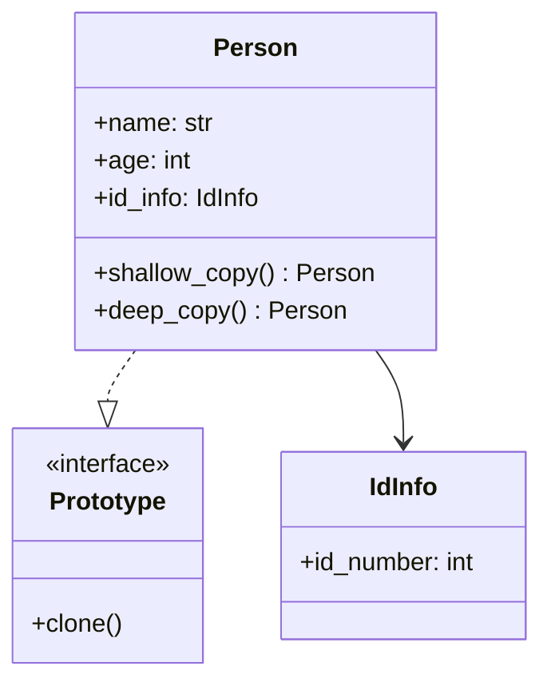

# Prototype

**Categoria:** Padrões Criacionais
**Referência:** https://refactoring.guru/pt-br/design-patterns/prototype
**Exemplo Python:** https://refactoring.guru/pt-br/design-patterns/prototype/python/example

## Propósito

O Prototype é um padrão de projeto criacional que permite copiar objetos existentes sem fazer seu código ficar dependente de suas classes.

## Problema

Digamos que você tenha um objeto configurado e queira criar uma cópia exata dele. Criar uma nova instância e copiar campo a campo funciona enquanto os campos forem visíveis, mas quebra quando há atributos privados ou objetos aninhados.

Além disso, copiar referências de objetos internos (cópia rasa) pode causar efeitos colaterais inesperados: alterar o objeto original também altera a cópia, porque ambos compartilham a mesma referência. O Prototype resolve isso delegando a clonagem para o próprio objeto, que sabe como copiar seus campos corretamente — incluindo uma cópia profunda quando necessário.

## Como Implementar

1. Crie uma interface ou classe base com um método `clone()`.
2. Implemente o método `clone()` nas classes concretas.
3. Use `copy.copy()` para clonagem rasa ou `copy.deepcopy()` para clonagem profunda, dependendo da necessidade.
4. Em hierarquias, chame a clonagem da classe pai para garantir que todos os campos sejam copiados.
5. O cliente clona objetos através da interface comum, sem depender das classes concretas.

## Relações com Outros Padrões

- Muitos projetos começam usando o **Factory Method** (mais simples e customizável por subclasses) e evoluem para **Abstract Factory**, **Prototype** ou **Builder** (mais flexíveis, porém mais complexos).
- **Abstract Factory** pode ser combinado com **Prototype**: ao invés de criar produtos do zero, a fábrica clona protótipos pré-configurados.
- **Prototype** pode ajudar a manter o histórico de comandos no padrão **Command**, armazenando cópias do estado antes da execução.
- Projetos que fazem uso intenso de **Composite** e **Decorator** frequentemente se beneficiam de **Prototype** para criar estruturas complexas a partir de modelos existentes.

## Diagrama



## Exemplo em Python

```python
from __future__ import annotations

import copy
from dataclasses import dataclass


@dataclass
class IdInfo:
    """Objeto aninhado usado para demonstrar o efeito da cópia rasa vs profunda."""
    id_number: int


@dataclass
class Person:
    """Representa uma pessoa que pode clonar a si mesma."""
    name: str
    age: int
    id_info: IdInfo

    def shallow_copy(self) -> Person:
        """Cria uma cópia rasa: atributos mutáveis compartilham referências."""
        return copy.copy(self)

    def deep_copy(self) -> Person:
        """Cria uma cópia profunda: todos os objetos aninhados são duplicados."""
        return copy.deepcopy(self)

    def __str__(self) -> str:
        return f"Name: {self.name}, Age: {self.age}, ID: {self.id_info.id_number}"


if __name__ == "__main__":
    original = Person(
        name="Jack Daniels",
        age=42,
        id_info=IdInfo(id_number=666),
    )

    shallow = original.shallow_copy()
    deep = original.deep_copy()

    print("Valores originais:")
    print(f"  original: {original}")
    print(f"  shallow:  {shallow}")
    print(f"  deep:     {deep}")

    # Altera apenas o objeto original.
    original.name = "Frank"
    original.age = 32
    original.id_info.id_number = 7878

    print("\nValores após alterar o original:")
    print(f"  original: {original}")
    print(f"  shallow:  {shallow}")
    print(f"  deep:     {deep}")

    print(f"\nReferências de id_info compartilhadas?")
    print(f"  original e shallow: {original.id_info is shallow.id_info}")
    print(f"  original e deep:    {original.id_info is deep.id_info}")
```

### Output

```
Valores originais:
  original: Name: Jack Daniels, Age: 42, ID: 666
  shallow:  Name: Jack Daniels, Age: 42, ID: 666
  deep:     Name: Jack Daniels, Age: 42, ID: 666

Valores após alterar o original:
  original: Name: Frank, Age: 32, ID: 7878
  shallow:  Name: Jack Daniels, Age: 42, ID: 7878
  deep:     Name: Jack Daniels, Age: 42, ID: 666

Referências de id_info compartilhadas?
  original e shallow: True
  original e deep: False
```
