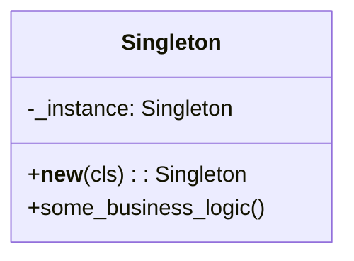

# Singleton

**Categoria:** Padrões Criacionais
**Referência:** https://refactoring.guru/pt-br/design-patterns/singleton
**Exemplo Python:** https://refactoring.guru/pt-br/design-patterns/singleton/python/example

## Propósito

O Singleton é um padrão de projeto criacional que permite garantir que uma classe tenha apenas uma instância, enquanto provê um ponto de acesso global para essa instância.

## Problema

O padrão Singleton resolve dois problemas de uma só vez, violando o princípio de responsabilidade única:

1. **Garantir que uma classe tenha apenas uma única instância.** A razão mais comum para isso é controlar o acesso a algum recurso compartilhado — por exemplo, uma base de dados, um arquivo de configuração ou um cache.
2. **Fornecer um ponto de acesso global para essa instância.** Assim como variáveis globais, o singleton permite que qualquer parte do código acesse o mesmo objeto, mas com a vantagem de evitar que novas instâncias sejam criadas acidentalmente.

Funciona assim: imagine que você criou um objeto e, depois de algum tempo, tentou criar um novo. Em vez de receber um objeto fresco, você obtém a mesma instância que já existia.

> **Nota pythonica:** Em Python, módulos são carregados uma única vez e atuam como singletons naturais. Para estado global simples, prefira um módulo com atributos e funções em vez de uma classe Singleton manual.

## Como Implementar

1. Crie uma classe e sobrescreva `__new__` para interceptar a criação de instâncias.
2. Armazene a instância criada em um atributo privado da própria classe.
3. Em chamadas subsequentes a `__new__`, retorne a instância já existente.
4. Adicione métodos de negócio que operem sobre o estado compartilhado.
5. No código cliente, crie objetos normalmente com `MinhaClasse()`; o `__new__` garante que a mesma instância seja retornada.

## Relações com Outros Padrões

- Uma classe **Facade** pode frequentemente ser transformada em um Singleton, já que um único objeto fachada é suficiente na maioria dos casos.
- **Flyweight** seria parecido com o Singleton se você reduzisse todos os estados compartilhados a um único objeto flyweight. As diferenças fundamentais são:
  - Deve haver apenas uma instância singleton, enquanto uma classe flyweight pode ter múltiplas instâncias com estados intrínsecos diferentes.
  - Objetos flyweight devem ser imutáveis, enquanto o singleton pode manter estado mutável.
- O Singleton pode ser usado em conjunto com **Abstract Factory**, **Builder** e **Prototype** quando for necessário garantir que determinado builder ou factory também tenha apenas uma instância.

## Diagrama



## Exemplo em Python

```python
"""
Singleton de configuração de aplicação.

Garante que haja apenas uma instância das configurações carregadas,
disponível globalmente para qualquer parte do programa.
"""

from __future__ import annotations


class AppConfig:
    """Ponto único de acesso às configurações da aplicação."""

    _instance: AppConfig | None = None

    def __new__(cls) -> AppConfig:
        if cls._instance is None:
            cls._instance = super().__new__(cls)
            cls._instance._initialized = False
        return cls._instance

    def __init__(self) -> None:
        # Evita recarregar valores se a instância já foi inicializada.
        if self._initialized:
            return
        self._theme = "light"
        self._timeout = 30
        self._initialized = True

    @property
    def theme(self) -> str:
        """Tema atual da aplicação."""
        return self._theme

    @theme.setter
    def theme(self, value: str) -> None:
        self._theme = value

    @property
    def timeout(self) -> int:
        """Tempo de expiração em segundos."""
        return self._timeout

    @timeout.setter
    def timeout(self, value: int) -> None:
        self._timeout = value

    def describe(self) -> str:
        """Retorna uma descrição legível das configurações."""
        return f"AppConfig(theme={self.theme!r}, timeout={self.timeout})"


if __name__ == "__main__":
    config_a = AppConfig()
    config_b = AppConfig()

    print(f"Mesma instância? {config_a is config_b}")
    print(f"Antes: {config_a.describe()}")

    config_b.theme = "dark"
    config_b.timeout = 60

    print(f"Depois (por config_a): {config_a.describe()}")
    print(f"Depois (por config_b): {config_b.describe()}")
```

### Output

```
Mesma instância? True
Antes: AppConfig(theme='light', timeout=30)
Depois (por config_a): AppConfig(theme='dark', timeout=60)
Depois (por config_b): AppConfig(theme='dark', timeout=60)
```

## Variante Pythonica

Para muitos cenários, um módulo Python simples já é suficiente e mais idiomático:

```python
# config.py
THEME = "light"
TIMEOUT = 30


def describe() -> str:
    return f"AppConfig(theme={THEME!r}, timeout={TIMEOUT})"
```

Qualquer importação de `config` em diferentes partes do programa referencia o mesmo módulo em memória, sem a necessidade de implementar uma classe Singleton manualmente.
