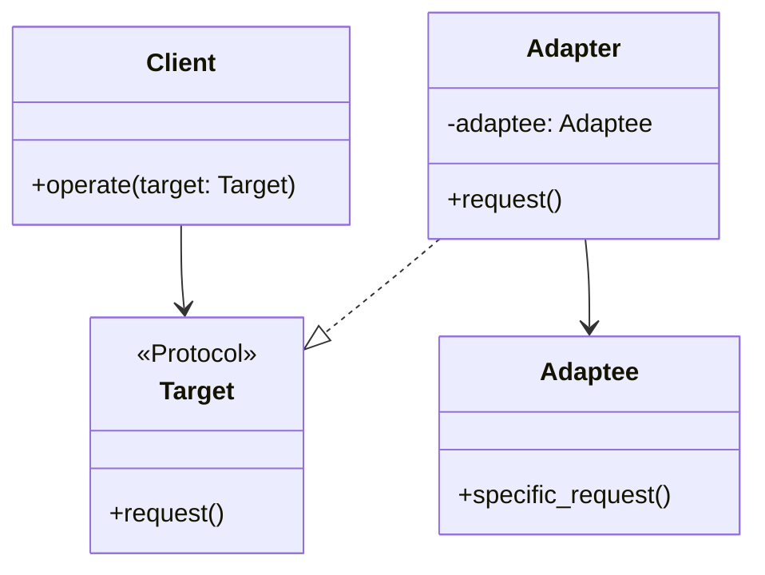

# Adapter

**Categoria:** Padrões Estruturais
**Referência:** https://refactoring.guru/pt-br/design-patterns/adapter
**Exemplo Python:** https://refactoring.guru/pt-br/design-patterns/adapter/python/example

## Propósito

O Adapter é um padrão de projeto estrutural que permite objetos com interfaces incompatíveis colaborarem entre si.

## Problema

Imagine que você está criando uma aplicação de monitoramento do mercado de ações que consome dados de múltiplas fontes em XML. Em determinado momento, você decide integrar uma biblioteca de análise de terceiros que só aceita dados em JSON.

Modificar a biblioteca diretamente pode quebrar seu funcionamento interno ou violar suas dependências. Criar um adaptador, por outro lado, permite converter a interface XML da sua aplicação na interface JSON esperada pela biblioteca, sem alterar nenhum dos dois lados.

## Como Implementar

1. Certifique-se de que existam pelo menos duas classes com interfaces incompatíveis:
   - Uma classe serviço útil que você não pode modificar (geralmente de terceiros, legada ou com muitas dependências).
   - Uma ou mais classes cliente que se beneficiariam ao usar essa classe serviço.

2. Declare a interface esperada pelo cliente. Em Python, isso pode ser um `Protocol` (PEP 544), uma `ABC` ou mesmo apenas duck typing, dependendo do nível de formalidade desejado.

3. Crie a classe adaptadora e faça-a seguir a interface esperada pelo cliente.

4. Armazene uma referência ao objeto serviço dentro do adaptador. A forma mais comum é injetá-la pelo construtor, mas também pode ser passada durante a chamada de um método.

5. Implemente os métodos da interface cliente na adaptadora, convertendo as chamadas para o formato compreendido pelo objeto serviço.

## Relações com Outros Padrões

- O **Bridge** é geralmente definido com antecedência, permitindo que você desenvolva partes de uma aplicação independentemente umas das outras. O **Adapter**, por outro lado, é comumente usado em aplicações existentes para fazer com que classes incompatíveis trabalhem bem juntas.
- O **Adapter** fornece uma interface completamente diferente para acessar um objeto existente. Já o **Decorator** mantém a mesma interface ou a estende, além de oferecer suporte à composição recursiva.
- O **Adapter** converte a interface de um objeto. O **Proxy** fornece a mesma interface, mas controla o acesso, adiciona cache, lazy loading ou proteção.

## Diagrama



## Exemplo em Python

```python
from typing import Protocol, runtime_checkable


@runtime_checkable
class Target(Protocol):
    """Interface que o código cliente espera utilizar."""

    def request(self) -> str:
        ...


class Adaptee:
    """Classe serviço com comportamento útil, mas interface incompatível."""

    def specific_request(self) -> str:
        return ".etadpada aloH"


class Adapter:
    """Torna a interface do Adaptee compatível com a interface Target."""

    def __init__(self, adaptee: Adaptee) -> None:
        self._adaptee = adaptee

    def request(self) -> str:
        # Converte a chamada do cliente para o formato esperado pelo Adaptee.
        data = self._adaptee.specific_request()
        translated = data[::-1]
        return f"Adapter: (TRADUZIDO) {translated}"


def client_code(target: Target) -> None:
    """Código cliente que opera sobre qualquer objeto compatível com Target."""
    print(target.request())


if __name__ == "__main__":
    print("Cliente: Funciona perfeitamente com objetos Target:")

    class ConcreteTarget:
        def request(self) -> str:
            return "Target: comportamento padrão."

    client_code(ConcreteTarget())
    print()

    adaptee = Adaptee()
    print("Cliente: A classe Adaptee tem uma interface estranha:")
    print(f"Adaptee: {adaptee.specific_request()}")
    print()

    print("Cliente: Mas consigo usá-la através do Adapter:")
    adapter = Adapter(adaptee)
    client_code(adapter)
```

### Output

```text
Cliente: Funciona perfeitamente com objetos Target:
Target: comportamento padrão.

Cliente: A classe Adaptee tem uma interface estranha:
Adaptee: .etadpada aloH

Cliente: Mas consigo usá-la através do Adapter:
Adapter: (TRADUZIDO) Hola adapdate.
```
