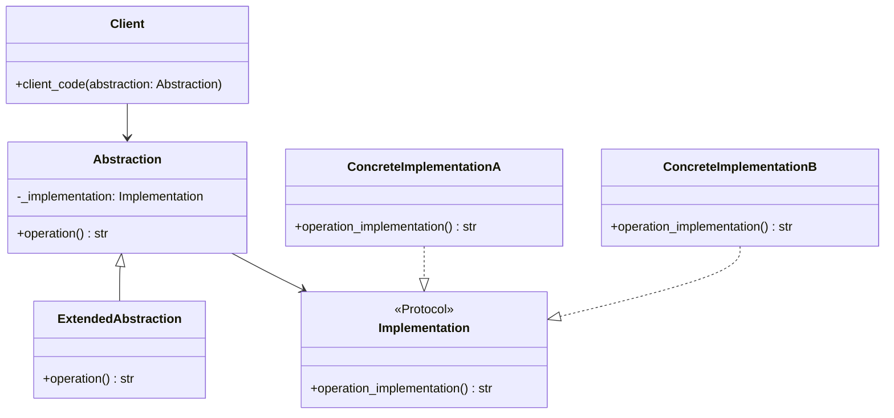

# Bridge

**Categoria:** Padrões Estruturais
**Referência:** https://refactoring.guru/pt-br/design-patterns/bridge
**Exemplo Python:** https://refactoring.guru/pt-br/design-patterns/bridge/python/example

## Propósito

O Bridge é um padrão de projeto estrutural que permite dividir uma classe grande ou um conjunto de classes intimamente ligadas em duas hierarquias separadas—abstração e implementação—que podem ser desenvolvidas independentemente umas das outras.

## Problema

Imagine que você tem uma hierarquia de formas geométricas, como `Círculo` e `Quadrado`, e quer adicionar cores a essas formas, como `Vermelho` e `Azul`. Se você misturar ambas as dimensões em uma única hierarquia, precisará criar uma classe para cada combinação: `CírculoVermelho`, `CírculoAzul`, `QuadradoVermelho`, `QuadradoAzul`. Cada nova forma ou cor multiplica o número de classes.

O Bridge resolve esse problema separando a abstração (o que o objeto faz) da implementação (como ele faz), permitindo que ambas evoluam sem criar uma explosão combinatória de subclasses.

## Como Implementar

1. **Identifique as dimensões ortogonais** em suas classes. Geralmente são pares como abstração/implementação, domínio/infraestrutura ou interface/plataforma.
2. **Defina a interface de implementação** com as operações primitivas que a abstração precisa. Em Python, um `Protocol` costuma ser suficiente.
3. **Crie implementações concretas** para cada plataforma, algoritmo ou variante de baixo nível.
4. **Declare a abstração base** com uma referência para a interface de implementação e delegue o trabalho real a esse objeto.
5. **Estenda a abstração** com subclasses especializadas quando necessário. Elas devem reutilizar a mesma interface de implementação sem duplicar código.
6. **No código cliente**, dependa apenas da abstração. A combinação entre abstração e implementação é configurada em tempo de montagem.

## Relações com Outros Padrões

- O **Bridge** é geralmente planejado com antecedência para permitir que partes de uma aplicação evoluam independentemente. O **Adapter** é usado posteriormente para fazer classes incompatíveis trabalharem juntas.
- O **Bridge**, **State**, **Strategy** e, em certo sentido, o **Adapter** têm estruturas parecidas porque todos se baseiam em composição. A diferença está na intenção: Bridge separa abstração de implementação, Strategy troca algoritmos e State altera comportamento conforme o estado interno.
- O **Abstract Factory** pode criar famílias de abstrações e implementações combinadas, mas o Bridge em si foca em desacoplar as duas hierarquias.
- O **Decorator** estende um objeto mantendo a mesma interface; o Bridge separa interfaces em duas hierarquias distintas.

## Diagrama



## Exemplo em Python

```python
from typing import Protocol


class Implementation(Protocol):
    """Interface de implementação com operações primitivas.

    Em Python, um Protocol é suficiente para declarar o contrato esperado
    pela abstração, sem forçar herança explícita nas implementações.
    """

    def operation_implementation(self) -> str:
        """Retorna o resultado específico da plataforma/variante."""
        ...


class Abstraction:
    """Abstração base que define a interface de alto nível.

    Mantém uma referência para um objeto de implementação e delega
    o trabalho real a ele.
    """

    def __init__(self, implementation: Implementation) -> None:
        self._implementation = implementation

    def operation(self) -> str:
        """Operação padrão oferecida ao cliente."""
        result = self._implementation.operation_implementation()
        return f"Abstraction: operação base com:\n{result}"


class ExtendedAbstraction(Abstraction):
    """Variante da abstração que estende o comportamento padrão."""

    def operation(self) -> str:
        result = self._implementation.operation_implementation()
        return f"ExtendedAbstraction: operação estendida com:\n{result}"


class ConcreteImplementationA:
    """Implementação concreta para a plataforma A."""

    def operation_implementation(self) -> str:
        return "ConcreteImplementationA: resultado na plataforma A."


class ConcreteImplementationB:
    """Implementação concreta para a plataforma B."""

    def operation_implementation(self) -> str:
        return "ConcreteImplementationB: resultado na plataforma B."


def client_code(abstraction: Abstraction) -> None:
    """Código cliente que opera apenas sobre a abstração.

    A combinação com uma implementação específica é feita fora daqui,
    permitindo trocar qualquer uma das duas hierarquias sem afetar o cliente.
    """
    print(abstraction.operation())


if __name__ == "__main__":
    implementation_a = ConcreteImplementationA()
    abstraction = Abstraction(implementation_a)
    client_code(abstraction)
    print()

    implementation_b = ConcreteImplementationB()
    abstraction = ExtendedAbstraction(implementation_b)
    client_code(abstraction)
```

### Output

```text
Abstraction: operação base com:
ConcreteImplementationA: resultado na plataforma A.

ExtendedAbstraction: operação estendida com:
ConcreteImplementationB: resultado na plataforma B.
```
