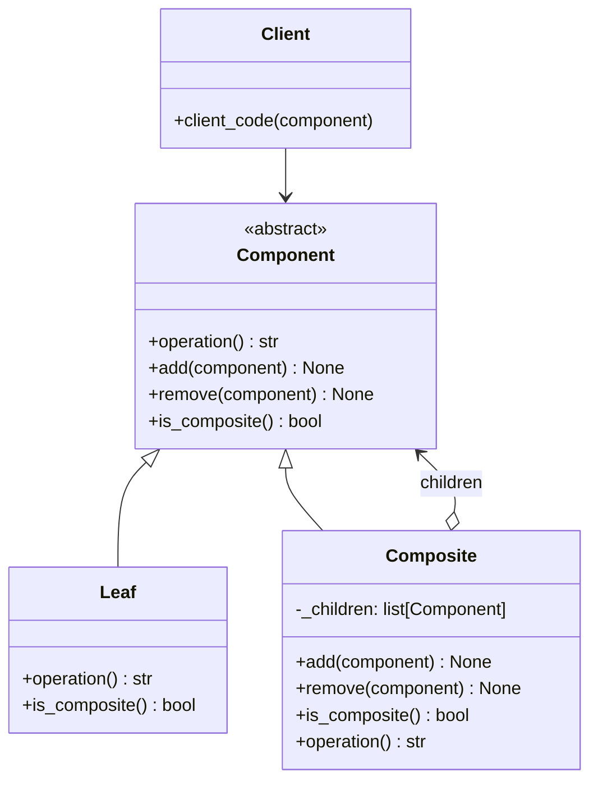

# Composite

**Categoria:** Padrões Estruturais
**Referência:** https://refactoring.guru/pt-br/design-patterns/composite
**Exemplo Python:** https://refactoring.guru/pt-br/design-patterns/composite/python/example

## Propósito

O Composite é um padrão de projeto estrutural que permite que você componha objetos em estruturas de árvore e então trabalhe com essas estruturas como se elas fossem objetos individuais.

## Problema

Usar o padrão Composite faz sentido quando o modelo central da sua aplicação pode ser representado como uma árvore.

Por exemplo, imagine que você tem dois tipos de objetos: `Produto` e `Caixa`. Uma `Caixa` pode conter vários `Produtos` e também outras `Caixas` menores. Essas caixas menores, por sua vez, também podem conter produtos ou outras caixas, e assim sucessivamente. O Composite permite tratar produtos e caixas de forma uniforme, sem que o cliente precise saber quem é folha e quem é composto.

## Como Implementar

1. **Modele a estrutura como uma árvore**: identifique os elementos simples (folhas) e os contêineres que podem agrupar outros elementos.
2. **Declare a interface/componente base**: defina as operações comuns a folhas e contêineres.
3. **Implemente as folhas**: classes que representam os elementos simples da árvore.
4. **Implemente os compostos**: classes que mantêm uma coleção de componentes e delegam as operações recursivamente aos filhos.
5. **Utilize a interface base no cliente**: o cliente manipula folhas e compostos de forma polimórfica.

## Relações com Outros Padrões

- **Builder**: pode ser usado para construir árvores Composite complexas de forma recursiva.
- **Chain of Responsibility**: frequentemente combinado com Composite; uma folha pode repassar uma solicitação pela cadeia de pais até a raiz.
- **Iterator**: pode percorrer os elementos de uma árvore Composite sem expor sua estrutura interna.
- **Visitor**: permite adicionar novas operações aos componentes da árvore sem modificá-los.
- **Decorator**: é semelhante estruturalmente, mas tem o objetivo de adicionar responsabilidades a um único objeto, não de compor uma árvore.

## Diagrama



## Exemplo em Python

```python
from abc import ABC, abstractmethod


class Component(ABC):
    """Interface comum para folhas e compostos."""

    @abstractmethod
    def operation(self) -> str:
        """Retorna a representação textual do componente."""
        ...

    def add(self, component: "Component") -> None:
        """Adiciona um filho. Folhas não precisam implementar."""
        raise NotImplementedError("Only composite components support add.")

    def remove(self, component: "Component") -> None:
        """Remove um filho. Folhas não precisam implementar."""
        raise NotImplementedError("Only composite components support remove.")

    def is_composite(self) -> bool:
        """Indica se o componente pode ter filhos."""
        return False


class Leaf(Component):
    """Elemento simples da árvore."""

    def operation(self) -> str:
        return "Leaf"

    def is_composite(self) -> bool:
        return False


class Composite(Component):
    """Contêiner que agrupa outros componentes."""

    def __init__(self) -> None:
        self._children: list[Component] = []

    def add(self, component: Component) -> None:
        self._children.append(component)

    def remove(self, component: Component) -> None:
        self._children.remove(component)

    def is_composite(self) -> bool:
        return True

    def operation(self) -> str:
        """Delega a operação recursivamente a todos os filhos."""
        results = [child.operation() for child in self._children]
        return f"Branch({'+'.join(results)})"


def client_code(component: Component) -> None:
    """O cliente trabalha com qualquer componente através da interface base."""
    print(f"RESULT: {component.operation()}")


def client_code2(component1: Component, component2: Component) -> None:
    """Como a gestão de filhos está na interface base, o cliente pode compor
    a árvore sem conhecer as classes concretas."""
    if component1.is_composite():
        component1.add(component2)
    print(f"RESULT: {component1.operation()}")


if __name__ == "__main__":
    leaf = Leaf()
    print("Client: I get a simple component:")
    client_code(leaf)
    print()

    tree = Composite()
    branch1 = Composite()
    branch1.add(Leaf())
    branch1.add(Leaf())
    branch2 = Composite()
    branch2.add(Leaf())
    tree.add(branch1)
    tree.add(branch2)

    print("Client: Now I've got a composite tree:")
    client_code(tree)
    print()

    print("Client: I don't need to check the components classes even when managing the tree:")
    client_code2(tree, leaf)
```

### Output

```
Client: I get a simple component:
RESULT: Leaf

Client: Now I've got a composite tree:
RESULT: Branch(Branch(Leaf+Leaf)+Branch(Leaf))

Client: I don't need to check the components classes even when managing the tree:
RESULT: Branch(Branch(Leaf+Leaf)+Branch(Leaf)+Leaf)
```
