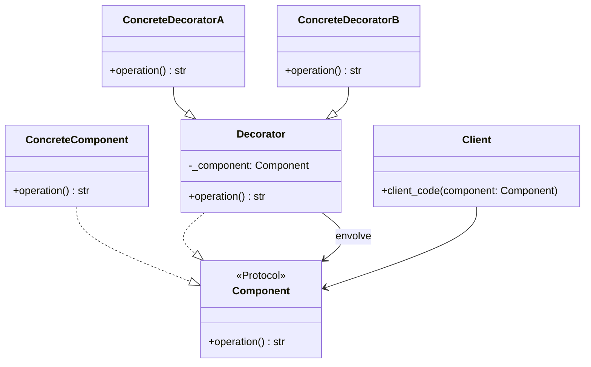

# Decorator

**Categoria:** Padrões Estruturais
**Referência:** https://refactoring.guru/pt-br/design-patterns/decorator
**Exemplo Python:** https://refactoring.guru/pt-br/design-patterns/decorator/python/example

## Propósito

O Decorator é um padrão de projeto estrutural que permite adicionar comportamentos a objetos dinamicamente, ao envolvê-los em outros objetos que implementam a mesma interface.

## Problema

Imagine que você está construindo uma biblioteca de notificações. A versão inicial possui apenas uma classe que envia mensagens por e-mail. Com o tempo, surgem demandas para enviar a mesma mensagem também por SMS, Slack, Facebook e outros canais. Criar subclasses para cada combinação de canais (Email+SMS, Email+Slack, Email+SMS+Slack...) leva a uma explosão combinatória de classes e dificulta a manutenção. O Decorator resolve isso permitindo empilhar comportamentos de forma flexível em tempo de execução.

## Como Implementar

1. Identifique o componente base e as responsabilidades que podem ser adicionadas dinamicamente.
2. Defina a interface comum do componente. Em Python, use um `Protocol`, uma `ABC` ou duck typing, conforme o nível de formalidade desejado.
3. Implemente o componente concreto com o comportamento base.
4. Crie o decorador base, armazenando uma referência ao componente envolvido e delegando todas as operações para ele.
5. Crie decoradores concretos herdando do decorador base e adicionando comportamentos antes ou depois de delegar a chamada.
6. No código cliente, trate componentes simples e decorados através da mesma interface.

## Relações com Outros Padrões

- O **Adapter** fornece uma interface completamente diferente para acessar um objeto existente. O **Decorator** mantém a mesma interface ou a estende, além de oferecer suporte à composição recursiva.
- O **Proxy** fornece a mesma interface, mas controla acesso, cache ou lazy loading. O **Decorator** usa a mesma interface para adicionar responsabilidades ao objeto envolvido.
- O **Composite** é estruturalmente semelhante, mas tem o objetivo de compor objetos em estruturas de árvore, enquanto o **Decorator** envolve um único componente por vez.
- O **Strategy** altera o comportamento interno trocando o algoritmo; o **Decorator** envolve o objeto para adicionar comportamentos de forma transparente ao cliente.

## Diagrama



## Exemplo em Python

```python
from typing import Protocol


class Component(Protocol):
    """Interface comum para componentes e decoradores."""

    def operation(self) -> str:
        ...


class ConcreteComponent:
    """Componente concreto com o comportamento base."""

    def operation(self) -> str:
        return "ConcreteComponent"


class Decorator:
    """Decorador base. Delega as operações para o componente envolvido."""

    def __init__(self, component: Component) -> None:
        self._component = component

    def operation(self) -> str:
        return self._component.operation()


class ConcreteDecoratorA(Decorator):
    """Decorador concreto que estende o resultado do componente envolvido."""

    def operation(self) -> str:
        return f"ConcreteDecoratorA({super().operation()})"


class ConcreteDecoratorB(Decorator):
    """Outro decorador concreto. Pode executar comportamentos antes ou depois
    de delegar a chamada ao componente envolvido."""

    def operation(self) -> str:
        return f"ConcreteDecoratorB({super().operation()})"


def client_code(component: Component) -> None:
    """O cliente trabalha com qualquer objeto que siga a interface Component."""
    print(f"RESULT: {component.operation()}")


if __name__ == "__main__":
    simple = ConcreteComponent()
    print("Cliente: tenho um componente simples:")
    client_code(simple)
    print()

    # Os decoradores podem envolver não apenas componentes simples,
    # mas também outros decoradores.
    decorator1 = ConcreteDecoratorA(simple)
    decorator2 = ConcreteDecoratorB(decorator1)
    print("Cliente: agora tenho um componente decorado:")
    client_code(decorator2)
```

### Output

```text
Cliente: tenho um componente simples:
RESULT: ConcreteComponent

Cliente: agora tenho um componente decorado:
RESULT: ConcreteDecoratorB(ConcreteDecoratorA(ConcreteComponent))
```
