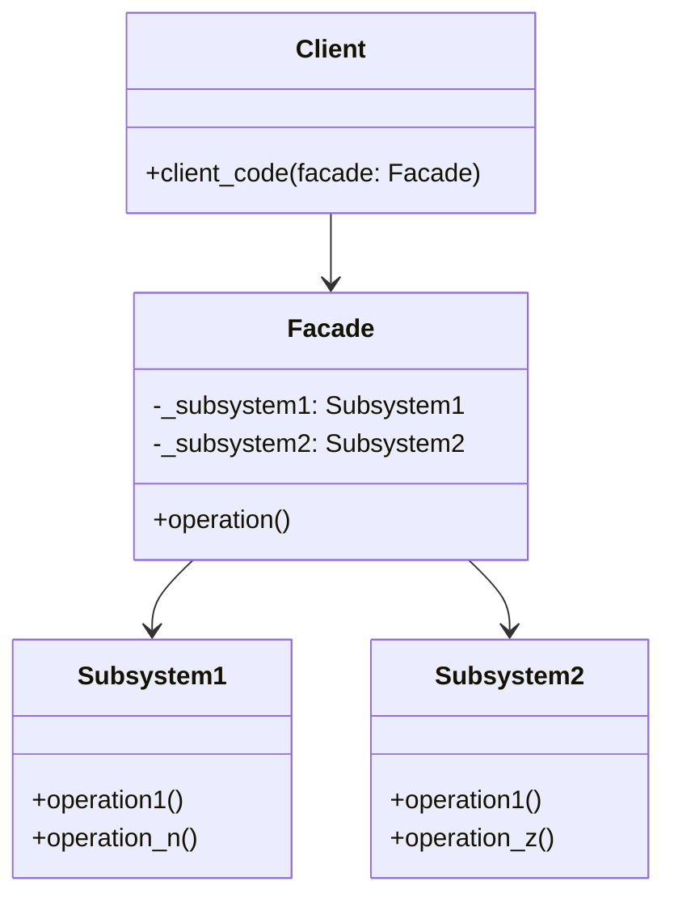

# Facade

**Categoria:** Padrões Estruturais
**Referência:** https://refactoring.guru/pt-br/design-patterns/facade
**Exemplo Python:** https://refactoring.guru/pt-br/design-patterns/facade/python/example

## Propósito

O Facade é um padrão de projeto estrutural que fornece uma interface simplificada para uma biblioteca, um framework, ou qualquer conjunto complexo de classes.

## Problema

Imagine que você precisa fazer seu código funcionar com um amplo conjunto de objetos que pertencem a uma biblioteca ou framework sofisticado. Normalmente, você teria que inicializar todos esses objetos, rastrear dependências, executar métodos na ordem correta e lidar com detalhes de configuração.

Como resultado, a lógica de negócio das suas classes fica firmemente acoplada aos detalhes de implementação de terceiros, dificultando a compreensão e a manutenção do sistema.

## Como Implementar

1. Verifique se é possível oferecer uma interface mais simples do que a que o subsistema já expõe. Você está no caminho certo se essa interface tornar o código cliente independente de muitas classes do subsistema.

2. Declare e implemente essa interface em uma nova classe fachada. A fachada deve redirecionar as chamadas do cliente para os objetos apropriados do subsistema.

3. Faça a fachada gerenciar o ciclo de vida dos objetos do subsistema, a menos que o cliente já os tenha criado. Dê preferência à injeção de dependências quando o cliente precisar controlar a criação.

4. Faça todo o código cliente se comunicar com o subsistema apenas através da fachada. Assim, o cliente fica protegido de mudanças internas no subsistema.

## Relações com Outros Padrões

- O **Facade** define uma nova interface para objetos existentes, enquanto o **Adapter** adapta uma interface existente para ser utilizável. O Adapter geralmente envolve apenas um objeto, enquanto o Facade trabalha com um subsistema inteiro.
- O **Abstract Factory** pode servir como alternativa ao Facade quando você precisa apenas esconder do cliente a forma como os objetos do subsistema são criados.
- O **Flyweight** mostra como criar vários pequenos objetos, enquanto o **Facade** mostra como criar um único objeto que representa um subsistema inteiro.
- O **Mediator** é semelhante ao Facade no sentido de consolidar a comunicação, mas o Mediator adiciona comportamento próprio e seus componentes não sabem que ele existe, diferentemente do Facade, que apenas simplifica o acesso.

## Diagrama Mermaid



## Exemplo em Python

```python
from __future__ import annotations


class Subsystem1:
    """Parte do subsistema que expõe operações específicas."""

    def operation1(self) -> str:
        return "Subsystem1: Pronto!"

    def operation_n(self) -> str:
        return "Subsystem1: Vai!"


class Subsystem2:
    """Outra parte do subsistema com suas próprias operações."""

    def operation1(self) -> str:
        return "Subsystem2: Prepare-se!"

    def operation_z(self) -> str:
        return "Subsystem2: Fogo!"


class Facade:
    """
    Fornece uma interface simples para a lógica complexa de um ou mais
    subsistemas. A fachada delega as requisições do cliente para os objetos
    corretos e gerencia a inicialização quando necessário.
    """

    def __init__(
        self,
        subsystem1: Subsystem1 | None = None,
        subsystem2: Subsystem2 | None = None,
    ) -> None:
        self._subsystem1 = subsystem1 or Subsystem1()
        self._subsystem2 = subsystem2 or Subsystem2()

    def operation(self) -> str:
        """Método conveniente que orquestra as operações dos subsistemas."""
        result: list[str] = [
            "Facade: Inicializando subsistemas:",
            self._subsystem1.operation1(),
            self._subsystem2.operation1(),
            "Facade: Ordenando a execução da ação:",
            self._subsystem1.operation_n(),
            self._subsystem2.operation_z(),
        ]
        return "\n".join(result)


def client_code(facade: Facade) -> None:
    """Código cliente que utiliza o subsistema complexo através da fachada."""
    print(facade.operation())


if __name__ == "__main__":
    # O cliente pode criar os subsistemas por conta própria...
    subsystem1 = Subsystem1()
    subsystem2 = Subsystem2()
    facade = Facade(subsystem1, subsystem2)

    # ...ou deixar a fachada gerenciar a criação internamente.
    facade_default = Facade()

    print("Cliente: Usando fachada com subsistemas injetados:")
    client_code(facade)
    print()

    print("Cliente: Usando fachada com subsistemas padrão:")
    client_code(facade_default)
```

### Output

```text
Cliente: Usando fachada com subsistemas injetados:
Facade: Inicializando subsistemas:
Subsystem1: Pronto!
Subsystem2: Prepare-se!
Facade: Ordenando a execução da ação:
Subsystem1: Vai!
Subsystem2: Fogo!

Cliente: Usando fachada com subsistemas padrão:
Facade: Inicializando subsistemas:
Subsystem1: Pronto!
Subsystem2: Prepare-se!
Facade: Ordenando a execução da ação:
Subsystem1: Vai!
Subsystem2: Fogo!
```
