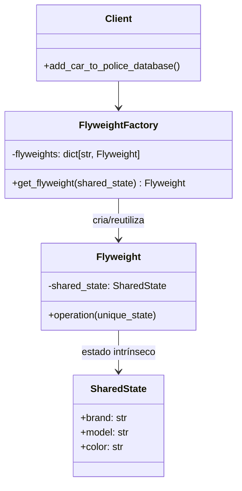

# Flyweight

**Categoria:** Padrões Estruturais
**Referência:** https://refactoring.guru/pt-br/design-patterns/flyweight
**Exemplo Python:** https://refactoring.guru/pt-br/design-patterns/flyweight/python/example

## Propósito

O Flyweight é um padrão de projeto estrutural que permite colocar mais objetos na RAM disponível ao compartilhar partes comuns de estado entre múltiplos objetos, em vez de manter todos os dados em cada instância.

## Problema

Imagine que você está desenvolvendo um jogo com um sistema de partículas: balas, mísseis e estilhaços voam pelo mapa. Cada partícula carrega uma textura, cor e modelo — dados visuais idênticos para milhares de objetos — além de dados únicos como posição e velocidade. Replicar o estado visual em cada instância esgota a memória rapidamente.

O mesmo acontece em aplicações de negócio, como uma base policial de veículos: muitos carros compartilham marca, modelo e cor, mas possuem placa e proprietário exclusivos. O Flyweight evita replicar o estado comum.

## Como Implementar

1. **Divida o estado da classe em intrínseco** (compartilhado, imutável) **e extrínseco** (contextual, único por objeto).
2. **Mantenha o estado intrínseco imutável** dentro do flyweight, definido apenas na criação.
3. **Passe o estado extrínseco como parâmetro** dos métodos, em vez de armazená-lo no objeto.
4. **Crie uma fábrica** que reutilize flyweights existentes ou crie novos quando necessário.
5. **Faça o cliente solicitar flyweights sempre pela fábrica**, fornecendo o estado extrínseco apenas nas operações.

## Relações com Outros Padrões

- Nós folha compartilhados de uma árvore **Composite** podem ser implementados como **Flyweights** para economizar memória.
- O **Flyweight** cria muitos pequenos objetos; o **Facade** cria um único objeto para representar um subsistema.
- Diferente do **Singleton**, que garante uma única instância global, o **Flyweight** permite múltiplas instâncias compartilhadas de acordo com o estado intrínseco.

## Diagrama



## Exemplo em Python

```python
from __future__ import annotations

from dataclasses import dataclass


@dataclass(frozen=True)
class SharedState:
    """Estado intrínseco: imutável e compartilhado entre vários carros."""

    brand: str
    model: str
    color: str


@dataclass
class UniqueState:
    """Estado extrínseco: único para cada carro registrado."""

    plates: str
    owner: str


class Flyweight:
    """Armazena estado compartilhado e recebe estado único via parâmetro."""

    def __init__(self, shared_state: SharedState) -> None:
        self._shared_state = shared_state

    def operation(self, unique_state: UniqueState) -> None:
        s = self._shared_state
        u = unique_state
        print(
            f"Flyweight: compartilhado ({s.brand}, {s.model}, {s.color}) "
            f"e único ({u.plates}, {u.owner})."
        )


class FlyweightFactory:
    """Cria e reutiliza flyweights de acordo com o estado compartilhado."""

    def __init__(self, initial_states: list[SharedState] | None = None) -> None:
        self._flyweights: dict[str, Flyweight] = {}
        for state in initial_states or []:
            self._flyweights[self._key(state)] = Flyweight(state)

    def _key(self, state: SharedState) -> str:
        return f"{state.brand}_{state.model}_{state.color}"

    def get_flyweight(self, shared_state: SharedState) -> Flyweight:
        key = self._key(shared_state)
        if key not in self._flyweights:
            print("FlyweightFactory: Flyweight não encontrado, criando novo.")
            self._flyweights[key] = Flyweight(shared_state)
        else:
            print("FlyweightFactory: Reutilizando flyweight existente.")
        return self._flyweights[key]

    def list_flyweights(self) -> None:
        print(f"\nFlyweightFactory: Tenho {len(self._flyweights)} flyweights:")
        for key in self._flyweights:
            print(key)


def add_car_to_police_database(
    factory: FlyweightFactory,
    brand: str,
    model: str,
    color: str,
    plates: str,
    owner: str,
) -> None:
    """Registra um carro reutilizando o estado compartilhado via fábrica."""
    print("\nClient: Adicionando carro ao banco de dados.")
    flyweight = factory.get_flyweight(SharedState(brand, model, color))
    flyweight.operation(UniqueState(plates, owner))


if __name__ == "__main__":
    factory = FlyweightFactory(
        [
            SharedState("Chevrolet", "Camaro2018", "pink"),
            SharedState("Mercedes Benz", "C300", "black"),
            SharedState("Mercedes Benz", "C500", "red"),
            SharedState("BMW", "M5", "red"),
            SharedState("BMW", "X6", "white"),
        ]
    )
    factory.list_flyweights()

    add_car_to_police_database(factory, "BMW", "M5", "red", "CL234IR", "James Doe")
    add_car_to_police_database(factory, "BMW", "X1", "red", "CL234IR", "James Doe")

    factory.list_flyweights()
```

### Output

```text
FlyweightFactory: Tenho 5 flyweights:
Chevrolet_Camaro2018_pink
Mercedes Benz_C300_black
Mercedes Benz_C500_red
BMW_M5_red
BMW_X6_white

Client: Adicionando carro ao banco de dados.
FlyweightFactory: Reutilizando flyweight existente.
Flyweight: compartilhado (BMW, M5, red) e único (CL234IR, James Doe).

Client: Adicionando carro ao banco de dados.
FlyweightFactory: Flyweight não encontrado, criando novo.
Flyweight: compartilhado (BMW, X1, red) e único (CL234IR, James Doe).

FlyweightFactory: Tenho 6 flyweights:
Chevrolet_Camaro2018_pink
Mercedes Benz_C300_black
Mercedes Benz_C500_red
BMW_M5_red
BMW_X6_white
BMW_X1_red
```
