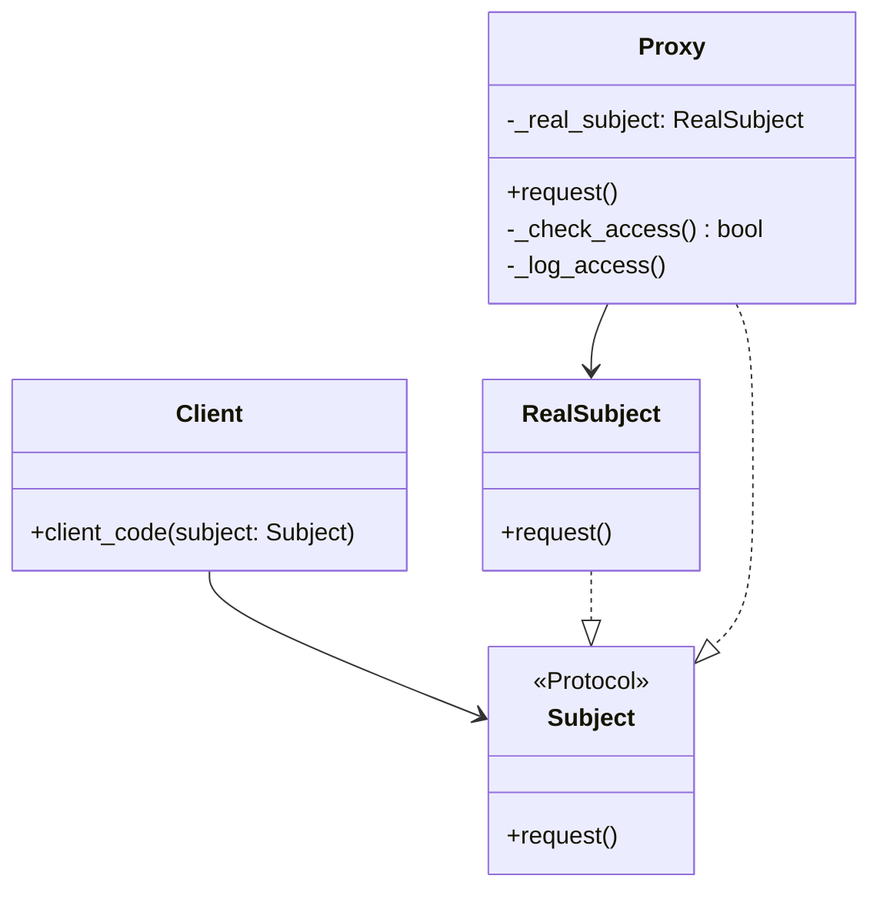

# Proxy

**Categoria:** Padrões Estruturais
**Referência:** https://refactoring.guru/pt-br/design-patterns/proxy
**Exemplo Python:** https://refactoring.guru/pt-br/design-patterns/proxy/python/example

## Propósito

O Proxy é um padrão de projeto estrutural que permite fornecer um substituto ou espaço reservado para outro objeto, controlando o acesso ao objeto original e executando ações antes ou depois do pedido chegar a ele.

## Problema

Por que controlar o acesso a um objeto? Imagine um objeto grande que consome muitos recursos do sistema, mas que só é necessário de tempos em tempos. Você poderia adiar sua criação (lazy loading), mas replicar essa lógica em todos os clientes gera código duplicado. O mesmo vale para cache, logging, validação de permissões ou proteção de objetos sensíveis. O Proxy centraliza essa responsabilidade sem alterar o objeto real.

## Como Implementar

1. Defina uma interface comum para o objeto real e o proxy. Em Python, um `Protocol` é suficiente para deixar o contrato explícito sem forçar herança.
2. Crie a classe do objeto real, que contém a lógica de negócio principal.
3. Crie a classe proxy com a mesma interface do objeto real. Ela mantém uma referência ao objeto real e o cria sob demanda ou recebe pronto.
4. Implemente os métodos do proxy adicionando o comportamento extra desejado (verificação de acesso, cache, lazy loading, logging etc.) e delegando ao objeto real quando apropriado.
5. O cliente deve trabalhar com ambos por meio da interface comum, tornando o proxy e o objeto real intercambiáveis.

## Relações com Outros Padrões

- **Adapter** muda a interface de um objeto existente; **Proxy** mantém a mesma interface.
- **Decorator** também envolve um objeto e mantém a mesma interface, mas seu propósito é adicionar responsabilidades de forma recursiva e compositiva. **Proxy** tem como foco o controle de acesso ao objeto envolvido.
- **Facade** simplifica uma API complexa e gerencia a inicialização de subsistemas, assim como alguns proxies. A diferença é que o **Proxy** tem a mesma interface do serviço, enquanto o **Facade** oferece uma interface nova e reduzida.

## Diagrama Mermaid



## Exemplo em Python

```python
from typing import Protocol


class Subject(Protocol):
    """Interface comum para RealSubject e Proxy."""

    def request(self) -> None:
        ...


class RealSubject:
    """Contém a lógica de negócio principal."""

    def request(self) -> None:
        print("RealSubject: Handling request.")


class Proxy:
    """Substituto do RealSubject com controle de acesso e logging."""

    def __init__(self, real_subject: RealSubject) -> None:
        self._real_subject = real_subject

    def request(self) -> None:
        if self._check_access():
            self._real_subject.request()
            self._log_access()

    def _check_access(self) -> bool:
        print("Proxy: Checking access prior to firing a real request.")
        return True

    def _log_access(self) -> None:
        print("Proxy: Logging the time of request.")


def client_code(subject: Subject) -> None:
    """Trabalha com qualquer objeto que siga o protocolo Subject."""
    subject.request()


if __name__ == "__main__":
    print("Client: Executing the client code with a real subject:")
    real_subject = RealSubject()
    client_code(real_subject)

    print()

    print("Client: Executing the same client code with a proxy:")
    proxy = Proxy(real_subject)
    client_code(proxy)
```

### Output

```
Client: Executing the client code with a real subject:
RealSubject: Handling request.

Client: Executing the same client code with a proxy:
Proxy: Checking access prior to firing a real request.
RealSubject: Handling request.
Proxy: Logging the time of request.
```
