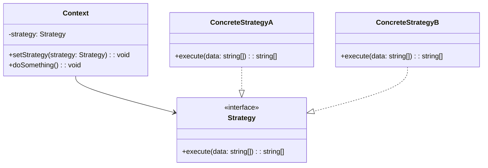

# Design Patterns em TypeScript — Skill de Referência

Skill que fornece acesso rápido aos 22 Design Patterns do GoF com exemplos em TypeScript,
extraídos do Refactoring.Guru e enriquecidos com diagramas e orientação prática.

## Quando esta skill é acionada

- Usuário pergunta sobre um design pattern em TypeScript/JavaScript
- Usuário quer patterns para Node.js, NestJS, Next.js, ou frontend
- Usuário quer ajuda para escolher um pattern para um problema em TS
- Usuário quer refatorar código TypeScript usando patterns
- Usuário pede comparação entre patterns no contexto TS
- Usuário menciona qualquer nome de GoF pattern + TypeScript

## Como usar os arquivos de referência

Os exemplos de código e descrições ficam em arquivos separados por categoria.
**Leia APENAS o arquivo do pattern relevante**, não carregue tudo de uma vez.

### Estrutura dos arquivos

```
patterns/
├── creational/          # Padrões Criacionais
│   ├── abstract-factory.md
│   ├── builder.md
│   ├── factory-method.md
│   ├── prototype.md
│   └── singleton.md
├── structural/          # Padrões Estruturais
│   ├── adapter.md
│   ├── bridge.md
│   ├── composite.md
│   ├── decorator.md
│   ├── facade.md
│   ├── flyweight.md
│   └── proxy.md
└── behavioral/          # Padrões Comportamentais
    ├── chain-of-responsibility.md
    ├── command.md
    ├── iterator.md
    ├── mediator.md
    ├── memento.md
    ├── observer.md
    ├── state.md
    ├── strategy.md
    ├── template-method.md
    └── visitor.md
```

### Índice rápido por pattern

| Pattern | Categoria | Arquivo | Propósito resumido |
|---------|-----------|---------|-------------------|
| Abstract Factory | Criacional | `creational/abstract-factory.md` | Produzir famílias de objetos relacionados |
| Builder | Criacional | `creational/builder.md` | Construir objetos complexos passo a passo |
| Factory Method | Criacional | `creational/factory-method.md` | Delegar criação a subclasses |
| Prototype | Criacional | `creational/prototype.md` | Clonar objetos existentes |
| Singleton | Criacional | `creational/singleton.md` | Garantir instância única |
| Adapter | Estrutural | `structural/adapter.md` | Compatibilizar interfaces incompatíveis |
| Bridge | Estrutural | `structural/bridge.md` | Separar abstração de implementação |
| Composite | Estrutural | `structural/composite.md` | Compor objetos em estruturas de árvore |
| Decorator | Estrutural | `structural/decorator.md` | Adicionar comportamentos via wrapper |
| Facade | Estrutural | `structural/facade.md` | Interface simplificada para subsistema complexo |
| Flyweight | Estrutural | `structural/flyweight.md` | Compartilhar estado para economizar memória |
| Proxy | Estrutural | `structural/proxy.md` | Substituto que controla acesso |
| Chain of Resp. | Comportamental | `behavioral/chain-of-responsibility.md` | Passar pedidos por uma cadeia de handlers |
| Command | Comportamental | `behavioral/command.md` | Encapsular pedido como objeto |
| Iterator | Comportamental | `behavioral/iterator.md` | Percorrer elementos sem expor estrutura |
| Mediator | Comportamental | `behavioral/mediator.md` | Reduzir dependências entre objetos |
| Memento | Comportamental | `behavioral/memento.md` | Salvar e restaurar estado anterior |
| Observer | Comportamental | `behavioral/observer.md` | Notificar sobre mudanças de estado |
| State | Comportamental | `behavioral/state.md` | Alterar comportamento conforme estado interno |
| Strategy | Comportamental | `behavioral/strategy.md` | Intercambiar algoritmos em runtime |
| Template Method | Comportamental | `behavioral/template-method.md` | Esqueleto de algoritmo com passos customizáveis |
| Visitor | Comportamental | `behavioral/visitor.md` | Separar algoritmos dos objetos que operam |

## Fluxo de resposta

### 1. Identificar o pattern

Se o usuário menciona um pattern por nome, use o `view` tool para ler o arquivo correspondente:
```
view patterns/{categoria}/{pattern-slug}.md
```

Se o usuário descreve um problema sem mencionar um pattern, use o índice acima para
recomendar o(s) pattern(s) mais adequados.

### 2. Apresentar a resposta

A resposta deve incluir, nesta ordem:

1. **Propósito** — Uma frase explicando o que o pattern resolve
2. **Diagrama** — Gerar um diagrama Mermaid com as classes/interfaces envolvidas
3. **Quando usar** — Situações práticas onde o pattern se aplica
4. **Exemplo em TypeScript** — Código do arquivo de referência, adaptado ao contexto
5. **Variante moderna TS** — Se aplicável, mostrar versões idiomáticas de TS (generics, decorators, etc.)
6. **Patterns relacionados** — Outros patterns que complementam ou são alternativas

### 3. Idiomas TypeScript modernos

Ao apresentar patterns em TypeScript, considere incluir variações idiomáticas quando relevante:
- **Generics** para type safety (ex: Builder<T>, Iterator<T>)
- **Decorators** (TC39 stage 3) como alternativa ao Decorator pattern clássico
- **Interfaces + type guards** para discriminated unions
- **Readonly + Immutability** para Memento e Prototype
- **Async patterns** (Observable, AsyncIterator) para Observer e Iterator
- **Dependency injection** frameworks (NestJS, tsyringe) para Factory e Singleton

### 4. Contextualizar quando possível

Se o usuário forneceu contexto sobre seu projeto (ex: NestJS API, Next.js app, multi-agent
system, React components), adapte o exemplo para usar nomes e estruturas do projeto dele.

### 5. Diagramas Mermaid

Sempre gere um diagrama de classes Mermaid. Exemplo:



## Guia de decisão: qual pattern usar?

| Problema | Pattern(s) sugerido(s) |
|----------|----------------------|
| Preciso criar objetos sem especificar a classe concreta | Factory Method, Abstract Factory |
| Preciso construir um objeto complexo com muitas configurações | Builder |
| Preciso copiar objetos sem depender de suas classes | Prototype |
| Preciso garantir uma única instância global | Singleton |
| Preciso adaptar uma interface incompatível | Adapter |
| Tenho muitas classes com combinações de variantes | Bridge |
| Preciso trabalhar com estruturas de árvore (DOM, componentes) | Composite |
| Preciso adicionar responsabilidades dinamicamente (middleware) | Decorator |
| Preciso simplificar uma API complexa | Facade |
| Tenho milhares de objetos similares consumindo memória | Flyweight |
| Preciso controlar acesso, cache, ou lazy loading | Proxy |
| Preciso processar um pedido por múltiplos handlers (middleware chain) | Chain of Responsibility |
| Preciso desacoplar quem invoca de quem executa (CQRS, event bus) | Command |
| Preciso percorrer uma coleção sem expor sua estrutura | Iterator |
| Tenho muitos objetos se comunicando de forma caótica | Mediator |
| Preciso de undo/redo ou snapshots de estado (state management) | Memento |
| Preciso notificar vários objetos sobre mudanças (RxJS, EventEmitter) | Observer |
| O comportamento muda conforme o estado do objeto | State |
| Preciso trocar algoritmos em runtime (validation, sorting, pricing) | Strategy |
| Tenho um algoritmo com passos fixos mas customizáveis | Template Method |
| Preciso adicionar operações sem modificar as classes (AST, visitors) | Visitor |

## Patterns mais usados no ecossistema TypeScript

| Framework/Contexto | Patterns comuns |
|-------------------|----------------|
| **NestJS** | Decorator, Singleton (providers), Factory, Strategy, Observer |
| **Next.js / React** | Composite (components), Observer (state), Strategy, Facade |
| **Express/Fastify** | Chain of Responsibility (middleware), Decorator, Adapter |
| **State management** | Observer (RxJS), Memento (undo/redo), Command (actions) |
| **Testing** | Builder (test data), Strategy (mocks), Adapter (test doubles) |

## Referência externa

Todos os patterns são baseados no catálogo do Refactoring.Guru:
https://refactoring.guru/pt-br/design-patterns/typescript
