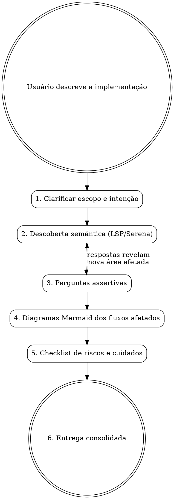
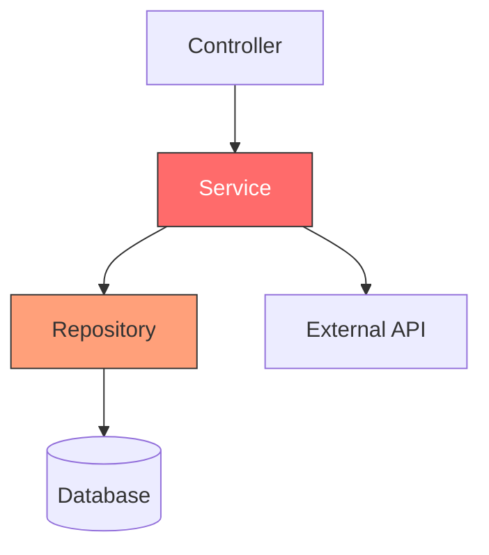
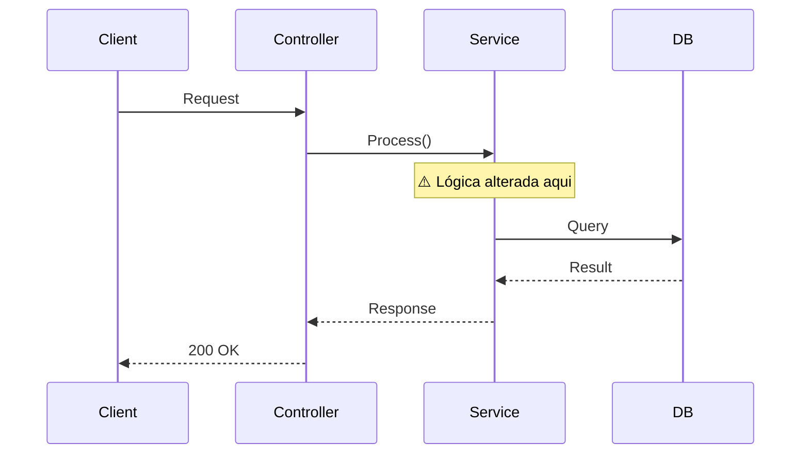

# Impact Analysis — Análise de Impacto Pré-Implementação

Skill que conduz uma análise profunda do código existente antes de qualquer implementação.
Usa busca semântica via LSP/Serena para mapear dependências, faz perguntas assertivas sobre
as partes envolvidas, e entrega diagramas Mermaid dos fluxos afetados + checklist de cuidados.

## Princípio Central

**Nunca implemente antes de entender o que vai quebrar.**

## Fluxo da Análise



---

## Fase 1 — Clarificar Escopo e Intenção

Antes de tocar em qualquer ferramenta, entenda o que o usuário quer.

**Pergunte:**
- O que exatamente você quer implementar/alterar?
- Qual o problema que isso resolve? (dor atual)
- Existe alguma restrição conhecida? (prazo, backward compatibility, feature flag)
- Quais módulos/camadas você **acha** que serão afetados?

**Não avance sem respostas claras.** Se o usuário for vago, reformule a pergunta com exemplos concretos.

---

## Fase 2 — Descoberta Semântica

Use ferramentas LSP e Serena para mapear o código envolvido. **Não leia arquivos inteiros** — use busca simbólica inteligente.

### Estratégia de Descoberta

```
1. get_symbols_overview  → Visão geral dos símbolos no arquivo/módulo alvo
2. find_symbol           → Localizar classes, métodos, interfaces mencionados pelo usuário
3. find_referencing_symbols → Quem CHAMA ou DEPENDE desses símbolos?
4. find_symbol (expandir) → Ler bodies apenas dos símbolos críticos
5. search_for_pattern    → Buscar padrões quando nome exato é desconhecido
```

### O que mapear

| Dimensão | Ferramenta | Objetivo |
|----------|-----------|----------|
| **Entry points** | `find_symbol` | Onde o fluxo começa (controllers, handlers, endpoints) |
| **Dependências diretas** | `find_referencing_symbols` | Quem chama o código que vai mudar |
| **Dependências inversas** | `find_referencing_symbols` | Quem o código alterado chama |
| **Interfaces/Contratos** | `get_symbols_overview` | Interfaces que podem quebrar |
| **Testes existentes** | `search_for_pattern` | Testes que cobrem o código afetado |
| **Configurações** | `search_for_pattern` | Config files, env vars, feature flags relacionados |

### Regras de Eficiência

- **Nunca** leia um arquivo inteiro se `get_symbols_overview` resolve
- **Nunca** leia o body de um símbolo que não é relevante para a mudança
- **Sempre** comece pelo símbolo mais próximo da mudança e expanda para fora
- **Pare** quando encontrar uma fronteira estável (interface pública, API contract, boundary de módulo)

---

## Fase 3 — Perguntas Assertivas

Com base no que descobriu na Fase 2, faça perguntas **específicas e fundamentadas** ao usuário.

### Modelo de Pergunta Assertiva

```
[Contexto do que encontrou] → [Pergunta específica] → [Por que importa]
```

**Exemplos:**

> Encontrei que `OrderService.ProcessPayment()` é chamado por 3 controllers diferentes
> e depende de `IPaymentGateway`. **A mudança que você quer fazer altera a assinatura
> desse método ou só a implementação interna?** Isso define se precisamos atualizar
> os 3 consumers ou não.

> Vi que `UserRepository` implementa `ICacheable` e tem um decorator de cache com TTL de 5min.
> **A alteração no modelo de User vai invalidar entradas de cache existentes?**
> Se sim, precisamos de uma estratégia de invalidação no deploy.

### Categorias de Perguntas

| Categoria | Exemplo |
|-----------|---------|
| **Contrato** | A interface pública muda? Quem consome essa API? |
| **Estado** | Há cache, sessão ou estado persistido que será afetado? |
| **Concorrência** | Múltiplos consumers acessam isso? Há race conditions? |
| **Dados** | Precisa de migração de banco? Dados existentes são compatíveis? |
| **Integrações** | Serviços externos dependem desse contrato? |
| **Testes** | Os testes existentes cobrem o cenário alterado? |
| **Rollback** | Se der problema em produção, como reverter? |

### Loop de Descoberta

Se uma resposta do usuário revela uma nova área afetada que não foi mapeada:

1. **Volte à Fase 2** — faça nova busca semântica na área revelada
2. Mapeie novas dependências
3. Formule novas perguntas sobre essa área
4. Só avance quando não houver mais áreas desconhecidas

---

## Fase 4 — Diagramas Mermaid

Gere diagramas que mostrem **visualmente** o que será afetado. Use os tipos de diagrama apropriados para cada situação.

### 4.1 Diagrama de Dependências (quem depende de quem)



**Legenda:**
- Vermelho forte = código que será **diretamente alterado**
- Laranja = código que será **indiretamente afetado**
- Sem cor = código que **não muda**

### 4.2 Diagrama de Sequência (fluxo que será afetado)



### 4.3 Diagrama de Classes (contratos e interfaces)

Use quando a mudança envolve alteração de interfaces, herança, ou composição.

### 4.4 Diagrama Before/After

Quando a mudança é significativa, mostre **dois diagramas lado a lado**:
- **ANTES**: Fluxo atual
- **DEPOIS**: Fluxo proposto

Isso torna o impacto visualmente óbvio.

### Regras para Diagramas

- **Sempre** destaque com cores os nós afetados
- **Sempre** inclua legenda de cores
- **Nunca** gere diagrama genérico — use nomes reais do código analisado
- **Limite** a 15-20 nós por diagrama. Se for maior, quebre em sub-diagramas por camada

---

## Fase 5 — Checklist de Riscos e Cuidados

Entregue uma checklist estruturada baseada na análise.

### Template de Entrega

```markdown
## 🔍 Análise de Impacto: [Nome da Implementação]

### Resumo
- **Escopo**: [1-2 frases]
- **Arquivos afetados**: [contagem]
- **Nível de risco**: [Baixo | Médio | Alto | Crítico]

### Símbolos Diretamente Alterados
| Símbolo | Arquivo | Tipo de Mudança |
|---------|---------|-----------------|
| `NomeClasse.Metodo()` | `path/file.cs` | Assinatura alterada |

### Dependências Afetadas (Efeito Cascata)
| Símbolo Dependente | Arquivo | Impacto |
|---------------------|---------|---------|
| `Consumer.Call()` | `path/other.cs` | Precisa atualizar chamada |

### [Diagramas Mermaid aqui]

### ⚠️ Cuidados Obrigatórios
- [ ] **Breaking change**: [descrever se aplica]
- [ ] **Migração de dados**: [descrever se aplica]
- [ ] **Cache invalidation**: [descrever se aplica]
- [ ] **Feature flag**: [recomendar se necessário]
- [ ] **Backward compatibility**: [descrever estratégia]
- [ ] **Testes a atualizar**: [listar testes afetados]
- [ ] **Configurações**: [env vars, config files a alterar]
- [ ] **Rollback plan**: [como reverter se der problema]

### 📋 Ordem de Implementação Sugerida
1. [Passo mais seguro primeiro]
2. [Próximo passo]
3. [...]
```

---

## Quando NÃO Usar Esta Skill

- Mudança trivial em um único arquivo sem dependências externas
- Correção de typo, formatação, ou comentário
- Greenfield (código novo sem dependências no existente)
- O usuário já tem um plano detalhado e só quer executar

## Ferramentas Necessárias

Esta skill funciona melhor com acesso a:
- **LSP tools** (find_symbol, get_symbols_overview, find_referencing_symbols)
- **Serena MCP** (para projetos configurados com Serena)
- **Grep/Glob** (fallback quando LSP não está disponível)

Se LSP/Serena não estiver disponível, use Grep + Glob como fallback para busca por padrões,
mas avise o usuário que a análise será menos precisa.
